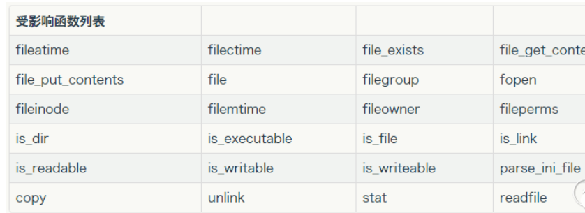

# 反序列化

```
反序列化又叫做对象属性注入漏洞(反序列化只能控制属性的值)，通过反序列化控制属性的值(一般查找代码执行、命令执行、文件读取、写入、删除等功能函数)
```

#### 原理：

```
由于序列化是将一个对象转换为特殊字符串，并且这种转换是可逆的，所以我们可以通过构造特定的字符串，在反序列化的时候覆盖成员属性的值以达到对应的目的(包括命令执行，代码执行，文件读取，文件写入、文件删除甚至getshell等等)
```

#### 相关魔术方法

```
__get 获取一个非公有或不存在属性或方法时触发该方法
__set 设置一个非公有或不存在的属性或方法室触发该方法
__construct 实例化一个对象时触发该方法
__destruct	销毁一个对象时触发该方法
__toString  将对象当作字符串处理时触发该方法
__call  	调用一个非公有或不存在的方法时触发该方法
__callStatic	调用一个非公有或不存在的静态方法时触发该方法
__sleep		sleep在对象进行序列化的时候触发该方法，用于指定需要序列化的属性，用数组返回（有的属性不愿意在）
__wakeup	当将一个特殊字符反序列化时出发该方法
__invoke()	把对象当作方法进行调用时触发该方法
```

####  注意事项:

##### 1、序列化字符串代表的类型

```
下面是字母代表的类型 
O – class 
o – common object一般对象
C – custom object 自定义对象
s – string 	
i – integer 	
d – double双精度型 
b – boolean布尔型
a – array 数组 
r – reference 				 		 		
N – null 			R – pointer reference 		U – unicode string unicode编码的字符串
```

##### 2、反序列化失败的原因:

```
如果反序列化失败,可能是因为缺少%00可以手动添加,尽量使用url编码
    PHP 序列化的时候 private和 protected 变量会引入不可见字符(进行url编码转换就是%00)
    
    Private私有的:  %00类名%00属性名 
    Protected受保护的:  %00*%00属性名
    url编码后的%00就是 ascii 码为0 的字符。这个字符显示和输出可能看不到，甚至导致截断，url编码后就可以看得清楚
```

#### 如何构造poc链?

```
1、找到unserialize函数的位置
0、全局搜索代码、找到危险函数的位置(文件操作函数、代码执行函数、命令执行函数等等)
1、查找该函数最终被执行的位置，然后逐步往上分析，看看是那个函数调用了该函数，该函数中是否调用其他类中的函数，采用这种方式进行分析，直到找到起始位置(一般是由魔术方法触发)
2、获取整个流程之后构造对应的poc连，进行成员属性的覆盖得到反序列化的字符串
```

#### 正则绕过

```
1、	' /[oc]:\d+:/i '  绕过
O:+3:"one":1:{s:1:"b";s:15:"eval($_GET[1]);";}  (+需要进行url编码 %2b)
O:%2b3:"one":1:{s:1:"b";s:15:"eval($_GET[1]);";}  (+需要进行url编码)

2、__wakeup()函数绕过 这是一个cve漏洞，cve-2016-7124 反序列化后可以通过更改字段个数的绕过
	public function __wakeup()
    {
        $this->password = 'hacker';
     }
    Php版本限制
        PHP5 < 5.6.25
        PHP7 < 7.0.10
```

#### Phar://反序列化

##### 需要将php.ini中的phar.readonly选项设置为off,否则无法生成phar文件

##### 特点:不在强制依赖unserialize 一般碰file相关的函数都会触发

```
phar文件本质上是一种压缩文件，其中每个被压缩文件的权限、属性等信息都放在这部分。这部分还会以序列化的形式存储用户自定义的meta-data，这是上述攻击手法最核心的地方。

在文件系统函数 (file_get_contents 、 unlink等)参数可控的情况下，配合 phar://伪协议 ，可以不依赖反序列化函数 unserialize() 直接进行反序列化的操作。
```

#### 触发phar反序列化操作的函数(一般都是文件操作的函数)



#### Stud:phar文件标识

```
<?php
Phar::mapPhar();
include 'phar://phar.phar/index.php’;
__HALT_COMPILER();
?>
可以理解为一个标志，格式为xxx<?php xxx; __HALT_COMPILER();?>，
前面内容不限，
但必须以__HALT_COMPILER();?>来结尾，
否则phar扩展将无法识别这个文件为phar文件。
也就是说如果我们留下这个标志位，构造一个图片或者其他文件，那么可以绕过上传限制，并且被 phar 这函数识别利用。

可以通过添加任意文件头+将phar伪装成其他格式的文件
比如:$phar->setStub("GIF89a"."<?php __HALT_COMPILER(); ?>"); //设置stub
```

#### Phar://反序列化利用条件

```
1、需要能够控制一个文件上传点
2、知道文件上传的相对路径
3、触发该漏洞的函数 phar协议
	
具体利用大致步骤为：
		1、生成一个phpar.phar文件(内部需要配置好对应的成员属性，方便触发析构函数进行反序列化时成员变量覆盖)	
		2、上传生成的phar文件，这是文件的后缀不做要求(可以为gif、jpg等后缀)
		3、访问触发反序列化漏洞 例如: ?filename=phar://./upload_file/phar.gif&2=phpinfo();
		
```


