# 弱类型

**类型比较表: https://www.php.net/manual/zh/types.comparisons.php**

### 类型转换

1、==  :会先进行类型转换，再进行对比

2、===:会先比较类型，如果类型不同直接返回false 

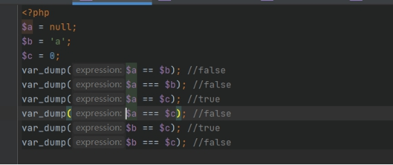 

```
'0' == false == 0  但是'0' != ''

当非数字与一个数字作比较,如果该字符串没有包含 . ,  e , E 并且其数值值在整形的范围之内，

该字符串被当作int来取值,否则当作float来取值.

字符串的开始部分决定了它的值，如果该字符串以合法的数值开始，则使用该数值，否则其值为0。
```


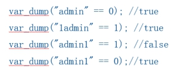 

 

### 0e-Md5哈希碰撞

```
比较运算时，如果遇到了0e这类字符串，PHP会将它解析为科学计数法。

它把每一个以”0E”开头的哈希值都解释为0，所以如果两个不同的密码经过哈希以后，其哈希值都是以”0E”开头的

，那么PHP将会认为他们相同，都是0
```


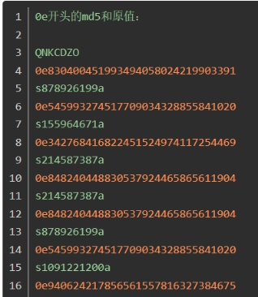 

**更多oe开头的md5值:https://blog.csdn.net/zz_Caleb/article/details/84947371**

```
<?php
@$input1 = $_GET['input1'];
@$input2 = $_GET['input2'];
if ($input1 != $input2 && md5($input1) == md5($input2)){
  echo "flag";
  var_dump(md5($input1));
  var_dump(md5($input2));
}
else{
  echo "no";
}
```


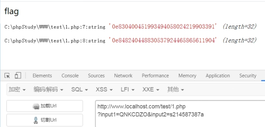 

 

### 0x 十六进制

```
在进行比较运算时，如果遇到了0x这类字符串，PHP会将它解析为十六进制。

var_dump("0x1046a" == "66666" );  // true
```


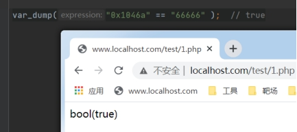 

 

### In_array

in_array(search,array,type): 如果给定的值 search 存在于数组 array 中则返回 true（类似于==）。

如果第三个参数设置为 true，函数只有在元素存在于数组中且数据类型与给定值相同时才返回 true（类似于===）。如果没有在数组中找到参数，函数返回 false。

 ```
<?php
$input = $_GET['input'];
$arr = array(0, 1, 2, 3, 4, 5);
if (in_array($input, $arr)) {
  echo 'ok';
}
else{
  echo 'no';
}

Foreach改编

<?php
$input = $_GET['input'];
$arr = array(0, 1, 2, 3, 4, 5);
foreach($arr as $k=>$v ):
  if ($v==$input){
    echo 'ok';
  }
endforeach;


 因为是数字型,检测到字符会停止 所以只识别到 1

?input=1 or 1=1
 ```


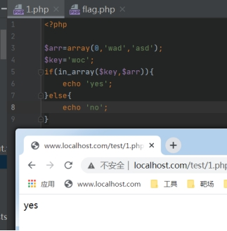 

### Strcmp

strcmp(string1，string2):比较括号内的两个字符串string1和string2，当他们两个相等时，返回0；string1的大于string2时，返回>0;小于时返回<0。

在5.3及以后的php版本中，当strcmp()括号内是一个数组与字符串比较时，也会返回0。

```
<?php

$a = 'bihuo.cn';
$b = array('hello','world');
$res = @strcmp($a,$b);
var_dump($res);
if($res == 0){
  echo '相等';
}else{
  echo '不相等';
}
```


[
](https://image.3001.net/images/20180327/15221618243084.png)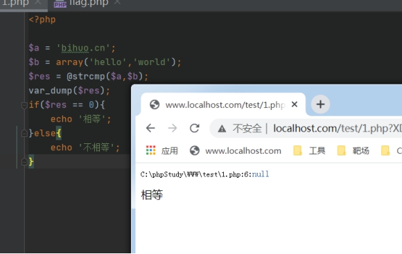

 

### MD5-array

```
md5()需要是一个string类型的参数。但是当你传递一个array时，md5()不会报错，

只是会无法正确地求出array的md5值，返回null，这样就会导致任意2个array的md5值都会相等。[

](https://image.3001.net/images/20180327/15221619168753.png)就是说,任何2个不同的数组, 比较md5值的结果会相等

<?php
  $a=[5,2,1,1,1,1];
  $b=[5,2,'s','v',1,1];
if ($a != $b && @md5($a) == @md5($b)){
  echo 'true';
}
else{
  echo 'false';
}
```


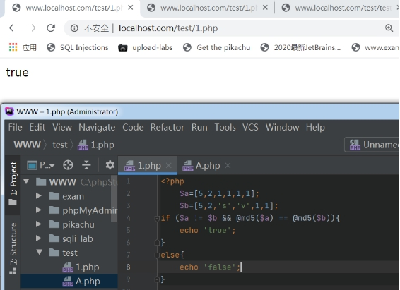 

 

### json_decode 相关的弱类型比较

```
<?php
include "test12345.php";

if (isset($_GET['message'])){
  $message = json_decode($_GET['message']);
  if ($message->key == $a){
    echo 'ok';
  }
  else{
    echo 'fail';
  }}
```


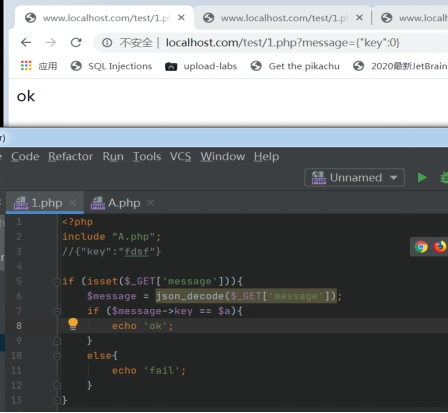 

key==$a会进行弱类型比较, 如果我们给key的值是0,那么字符串$a就会转换为数字型,转换后的值就是0 

所以key==$a成立  输出 ok

### array_search

```
array_search会遍历数组中每个键值,如果相等就会返回键名

格式:  array_search(针,大海);
```


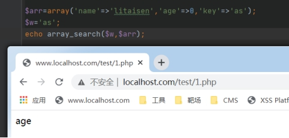 

```
<?php

if (!is_array($_GET['bihuo'])){				//我们输入一个数组 bihuo[]=0, 此时数组的值只有一个0

  die();

}

$bihuo = $_GET['bihuo'];					//把输入的数组赋值赋给 $bihuo

 

for($i = 0; $i < count($bihuo); ++$i){			//遍历$bihuo这个数组,如果有bihuo.cn就返回no

  if($bihuo[$i] === 'bihuo.cn'){			//我们是没有的,继续向下执行

'    echo 'no';

'    die();

  }

  $bihuo[$i] = intval($bihuo[$i]);			//此时,数组中的0 是一个字符串”0”,这里把他转换为数字型0

}

/*	在$bihuo中搜索'bihuo.cn',$bihuo仅有的一个值是数字0,他和'bihuo.cn'进行弱类型比较,'bihuo.cn'会进行类型转换为数字型,值为0, 0==0,array_search会返回true,然后返回$bihuo匹配到的值的键名 0===0,if条件成立,echo 'ok, you get it ';	*/

 

if (array_search('bihuo.cn', $bihuo) === 0){

  echo 'ok, you get it ';

}

else{

  echo 'no, you failed';

}
```


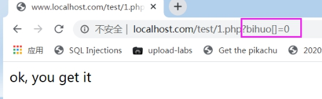 

### Switch比较缺陷

```
Switch会将$num和每个case的值做弱类型(==)的比较  

<?php

$num = '2hello';

switch ($num) {

  case 0:

'    echo '000000';

'    break;

  case 1:

'    echo '1111';

'    break;

  case 2:

'    echo 'bihuo';

'    break;

  case 3:

'    echo '333333';

'    break;

  default:

'    echo "this is default";

}

?>
```


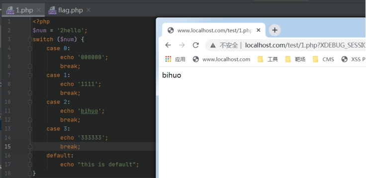 