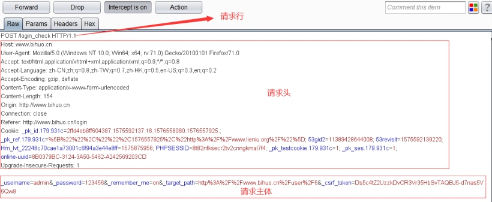
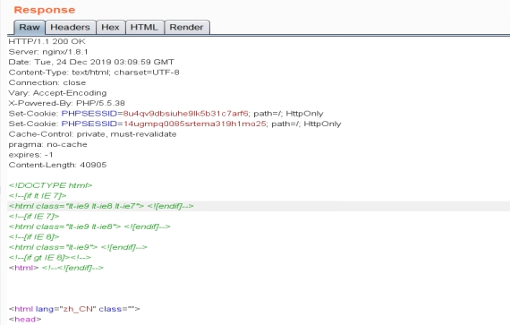
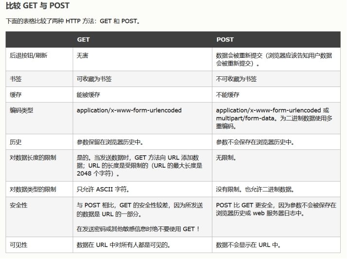

## HTTP请求报文

 

```
请求行：描述客户端的请求方式、请求资源的名称、http协议的版本号。

例如： POST /login_check HTTP/1.1


HTTP请求头

 请求头（消息头）包含（客户机请求的服务器主机名，客户机的环境信息等）：

 Host 	消息头用于指定出现在被访问的完整URL中的主机名称。

 User-Agent 这个消息头提供与浏览器或生成请求的其他客户端软件有关的信息。

 Accept 		这个消息头用于告诉服务器客户端愿意接受哪些内容，如图像类型、办公文档格式等。

 Accept-Language 用于声明服务器浏览器可以支持什么语言。

 Accept-Encoding 这个消息头用于告诉服务器，客户端愿意接受哪些内容编码。

 Origin  	这个消息头用在跨域Ajax请求中，字段里只包含是谁发起的请求，只存在于POST请求。

 Referer  	这个消息头用于指示提出当前请求的原始URL。

 Cookie  	提交此前服务器向客户端发送的其他参数（服务器使用Set-Cookie消息头来设置Cookie,一般用于身份验证）

 Connection 	通知通信的另一方，是否在完成HTTP传输后关闭TCP连接。

 If-Modified-Since	这个消息头用于说明浏览器最后一次收到所请求的资源的时间。

 Date：告诉服务器，当前请求的时间
```


## HTTP响应报文

每个HTTP响应的第一行由3个以上、空格间隔的项目组成。

• 使用的HTTP版本。

• 表示请求结果的数字状态码。

• 一段文本形式的"原因短语"。

 

```
 Date : 	

响应返回的时间，GMT代表格林威治时间（北京市位于东8区，计北京时间要加8小时）

 Server : 

这个消息头提供所使用的Web服务器软件的相关信息。

 Set-Cookie : 

这个消息头用于向浏览器发布cookie，浏览器会在随后的请求中将其返回给服务器。

 Vary: Accept-Encoding : 

告诉代理服务器缓存两种版本的资源：压缩和非压缩，这有助于避免一些公共代理不能正确地检测Content-Encoding标头的问题

 Expires :		

这个消息头用于向浏览器说明消息主体内容的有效时间。

 Connection : 

这个消息头用于告诉通信的另一端，在完成HTTP传输后是关闭TCP连接，还是保持连接开放以接收其他消息。

 Content-Type : 

这个消息头用于规定消息主体的内容类型。例如，HTML文档的内容类型为text/html 

 Cache-Control :	

这个消息头用于向浏览器传送缓存指令(如no-cache)。

 Content-Length : 	

这个消息头用于规定消息主体的字节长度。
```

## HTTP请求方法

```
HTTP1.0定义了三种请求方法： GET, POST ，HEAD

HTTP1.1新增了五种请求方法： OPTIONS , PUT, DELETE,  TRACE ，CONNECT

GET - 从指定的资源请求数据(url)

POST - 向指定的资源提交要被处理的数据(post)
```


 

```
 GET方法的作用在于获取资源. 通过URL传递,请求有长度限制

 POST方法的主要作用是执行操作.	通过HTTP协议传递,请求无长度限制

 

 HEAD这个方法的功能与GET方法相似，不同之处在于服务器不会在其响应中返回消息主体。服务器返回的消息头应与对应GET请求返回的消息头相同。因此，这种方法可用于检查某一资源在向其提交GET请求前是否存在。

 TRACE.这种方法主要用于诊断。服务器应在响应主体中返回其收到的请求消息的具体内容。这种方法可用于检测客户端与服务器之间是否存在任何操纵请求的代理服务器.

 OPTIONS这种方法要求服务器报告对某一特殊资源有效的HTTP方法。服务器通常返回一个包含Allow消息头的响应，并在其中列出所有有效的方法。

 PUT这个方法试图使用包含在请求主体中的内容，向服务器上传指定的资源。如果激活这个方法，渗透测试员就可以利用它来攻击应用程序。例如，通过上传任意一段脚本并在服务器上执行该脚本来攻击应用程序。

 DELETE 请求服务器删除指定的页面

 CONNECT HTTP/1.1 协议中预留给能够将连接改为管道方式的代理服务器
```


## 状态码

```
 1xx -提供信息。

 2xx—请求被成功提交。

 3xx—客户端被重定向到其他资源。

 4xx -请求包含某种错误。

 5xx—服务器执行请求时遇到错误。
```

```
100 Continue。当客户端提交一个包含主体的请求时.将发送这个响应。该响应表示已收到请求消息头.客户端应继续发送主体。请求完成后，再由服务器返回另一个响应。

200 Ok。本状态码表示已成功提交请求，且响应主体中包含请求结果。

201 Created. PUT	请求的响应返回这个状态码，表示请求已成功提交。

301 Moved Permanently。本状态码将浏览器永久重定向到另外一个在Location消息头中指定的URL。以后客户端应使用新URL替换原始URL。

302 Found。本状态码将浏览器暂时重定向到另外一个在Location消息头中指定的URL.客户端应在随后的请求中恢复使用原始URL.

304 Not Modified。本状态码指示浏览器使用缓存中保存的所请求资源的副本。服务器使用If-Modified-Since与If-None-Match消息头确定客户端是否拥有最新版本的资源。

400 Bad Request。本状态码表示客户端提交了一个无效的HTTP请求。当以某种无效的方式修改请求时(例如在URL中插人一个空格符)，可能会遇到这个状态码。

401 Unauthorized.服务器在许可请求前要求HTTP进行身份验证。WWW-Authenticate消息头详细说明所支持的身份验证类型。

403 Forbidden。本状态码指出，不管是否通过身份验证，禁止任何人访问被请求的资源。

404 Not Found。本状态码表示所请求的资源并不存在。

405 Method Not Allowed。本状态码表示指定的URL不支持请求中使用的方法。例如，如果试图在不支持PUT方法的地方使用该方法，就会收到本状态码。

413 Request Entity Too Large。如果在本地代码中探查缓冲器滋出瀚洞并就此提交超长数据串.则本状态码表示请求主体过长，服务器无法处理。

414 Request URI Too Long。与前一个响应类似，本状态码表示请求中的URL过长，服务器无法处理。

500Internal Server Error。本状态码表示服务器在执行请求时遇到错误。当提交无法预料的输人、在应用程序处理过程中造成无法处理的错误时，通常会收到本状态码。应该仔细检查服务器响应的所有内容，了解与错误性质有关的详情。

503 Service Unavailable。通常，本状态码表示尽管Web服务器运转正常.并且能够响应请求，但服务器访问的应用程序还是无法作出响应。应该进行核实，是否因为执行了某种行为而造成这个结果。
```

