# 蚂蚁剑流量分析

1. 蚁剑文件上传,文件下载,文件删除,文件改名,目录添加功能phpstorm调试

## 文件上传

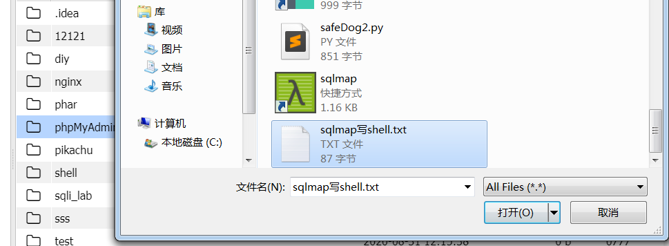 

拦截数据包进行解码

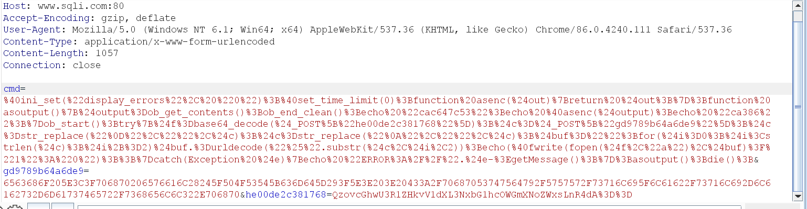 

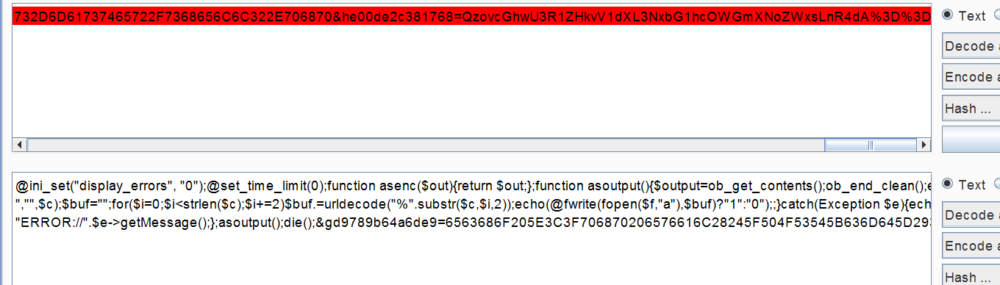 

创建文件调试分析

将上传的文件路径进行base解码，打开缓冲区，使用循环将上传的文件中的内容(文件上传的内容已经被转换为asccii码)从0开始每相邻两个截取作为ascii码进行url解码后追加到缓冲区$buf中,这里使用的是 . 进行字符串拼接

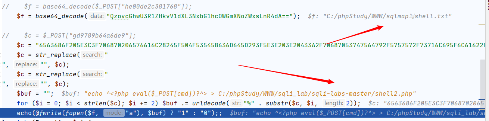 

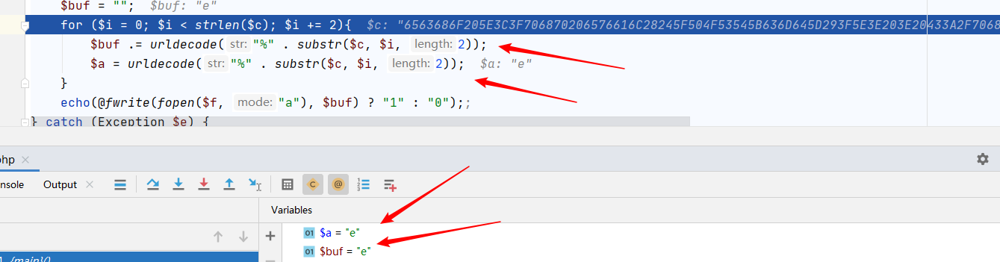 

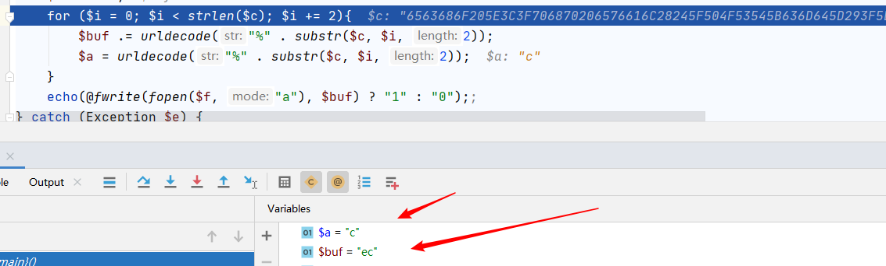 

最后得到缓冲区中的内容，打开文件，名称为上传的文件名称，再次将文件写入到里面

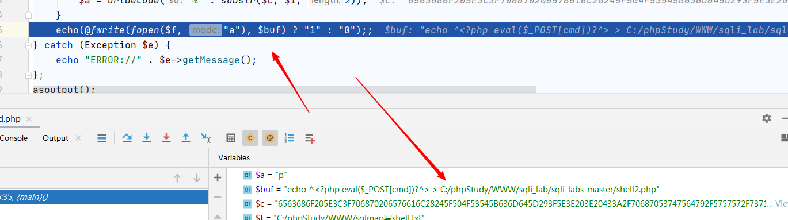 

## 文件下载

拦截数据包进行解码

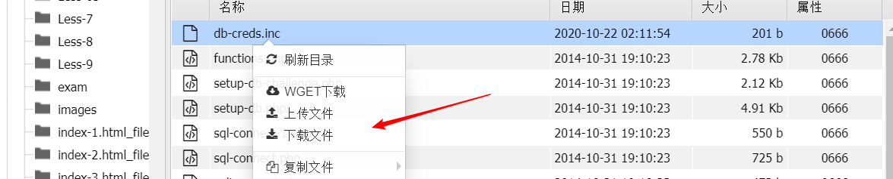 

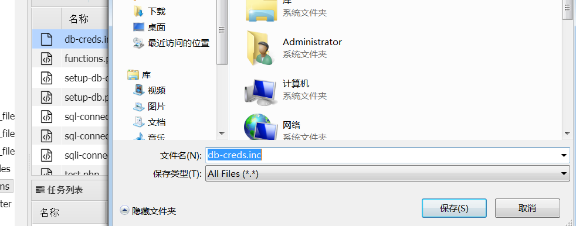 

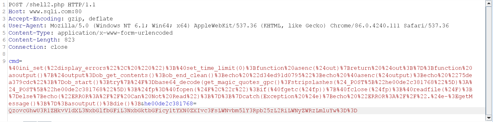 

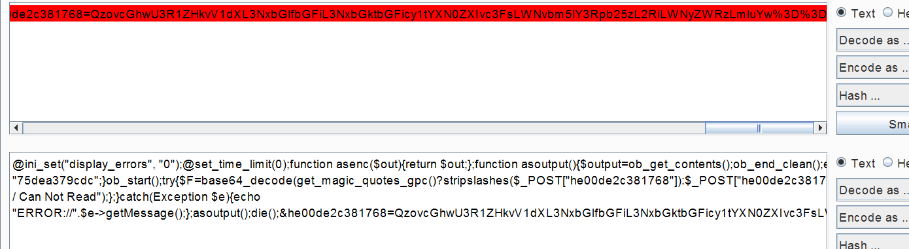 

创建文件调试分析

开启缓冲区，将下载的文件名进行魔术方法检测并进行base64解码,并在下载路径下面打开该文件

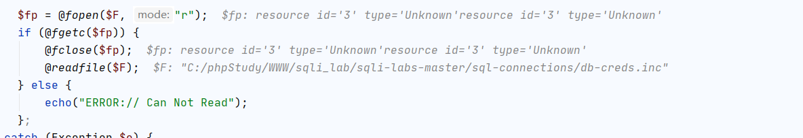 

读取服务器下载中文件的内容放到缓冲区中然后输出到本地下载的文件中

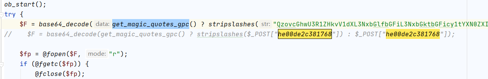 

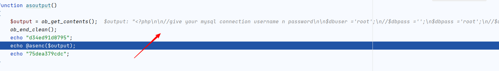 

## 文件删除

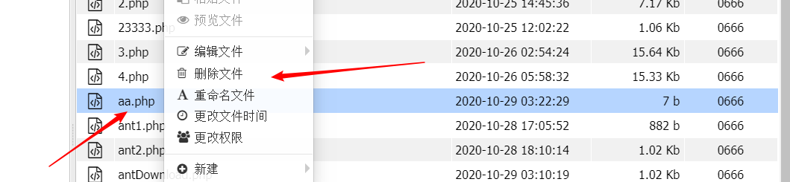 

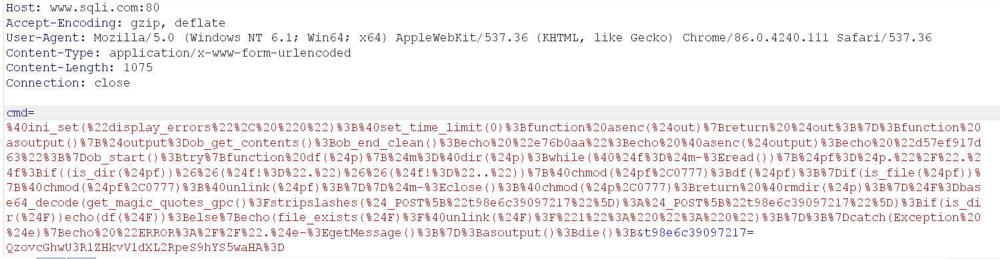 

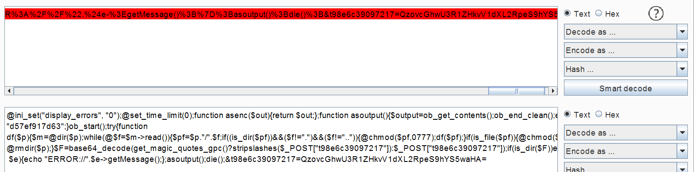 

调式代码分析功能点

服务器将蚁剑发送的进行base64解码，得到需要删除的文件和路径，并判断删除的是一个文件还是一个目录,如果是一个文件就判断该文件是否存在，如果文件存在就将该文件删除

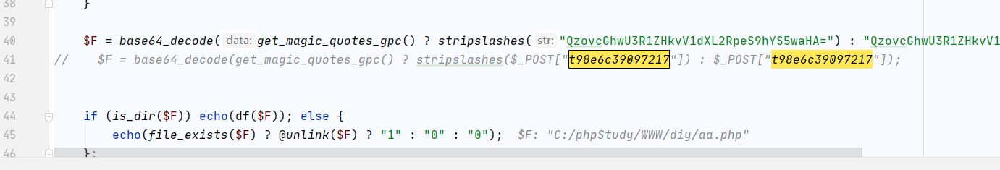 

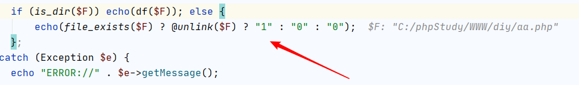 

如果删除的是一个目录

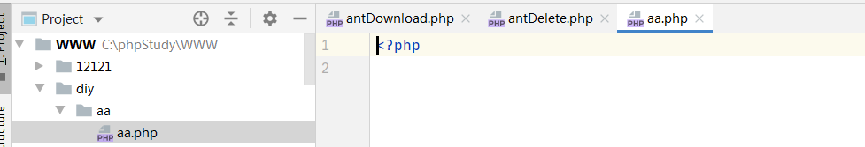 

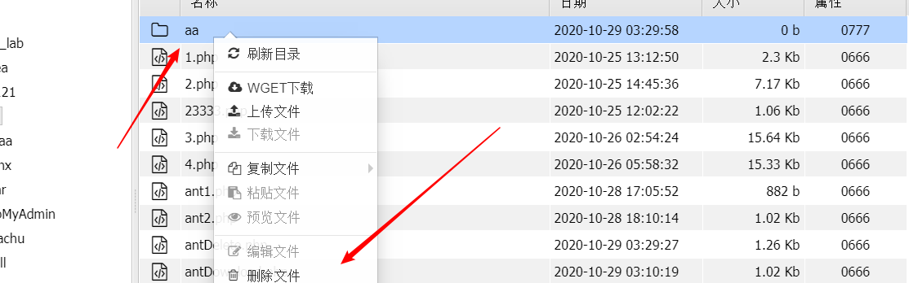 

 

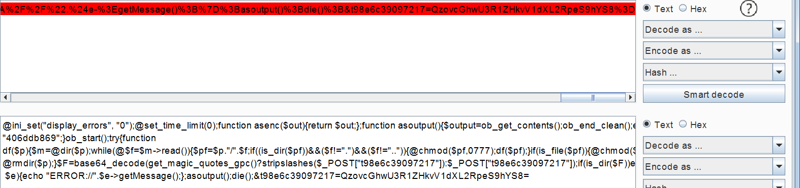 

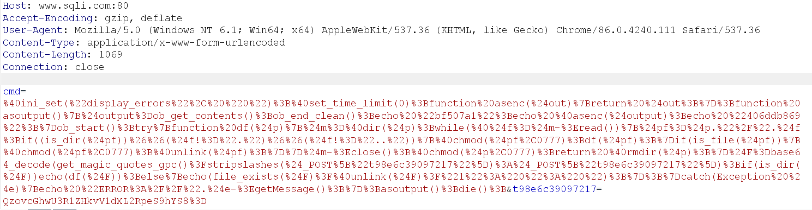 

就需要便利该目录下面的所有文件，每次便利一个并删除，最后将目录删除掉

 

 

## 文件重命名

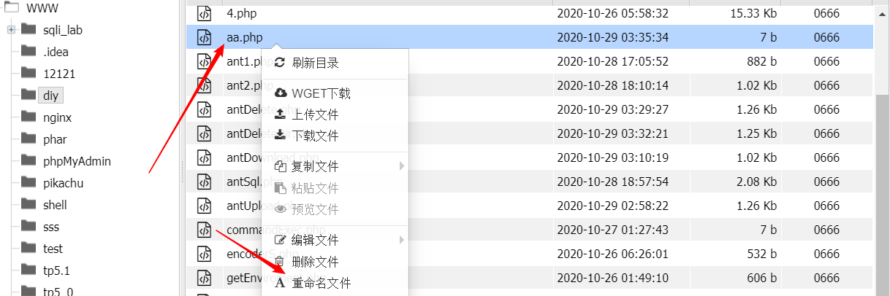 

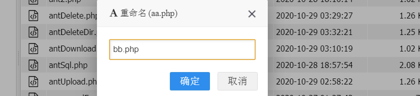 

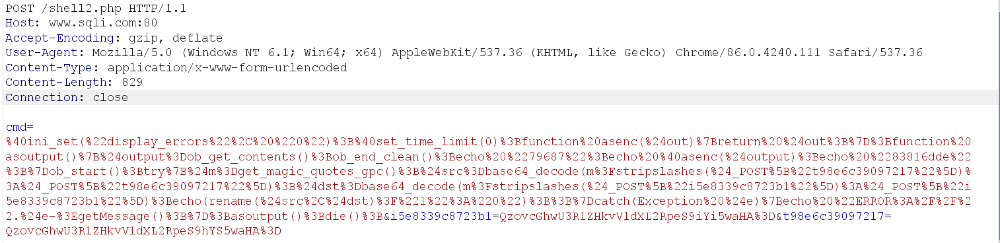 

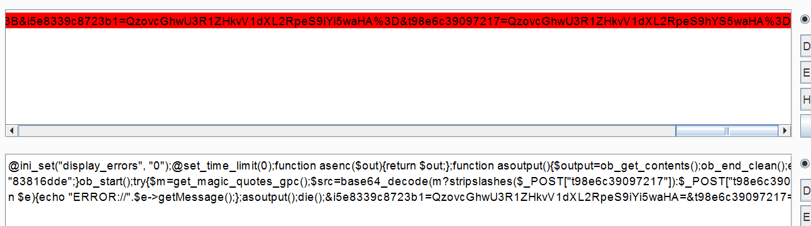 

调试分析

首先获取源文件名称和改名之后的文件名称

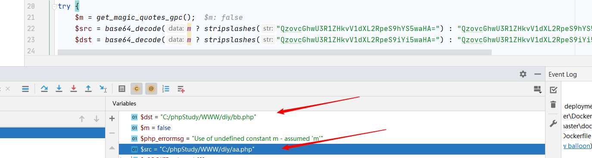 

调用改名函数进行文件名修改，并对是否改名成功进行判断，如果成功就进行相应的提示

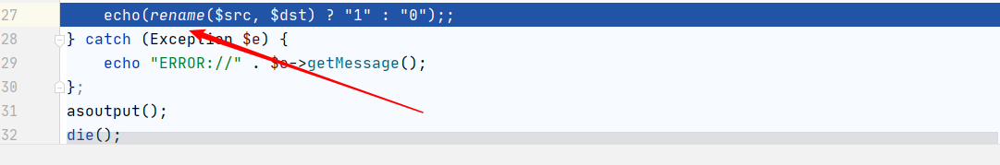 

 

## 目录添加

 

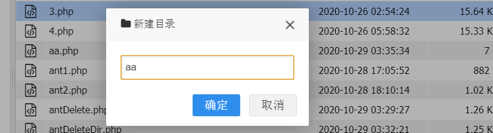 

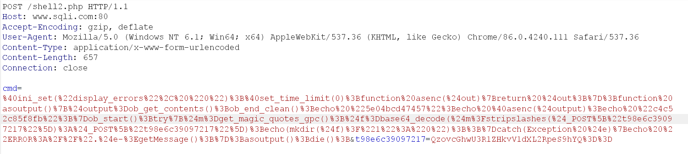 

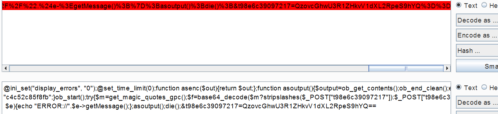 

 

调试分析

将创建的目录进行base64解码，调用mkdir()函数创建目录，并对创建目录是否成功进行判断，如果成功就进行相应的提示

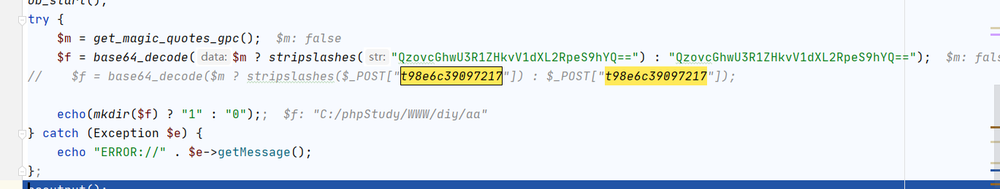 

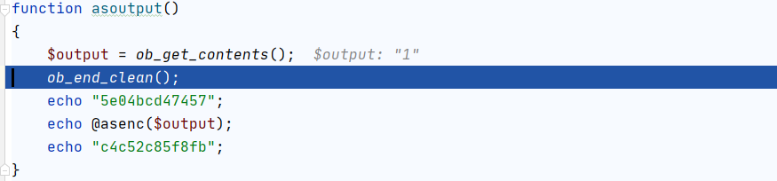 

 

2. 蚁剑数据库连接,数据库sql语句执行phpstorm调试

 

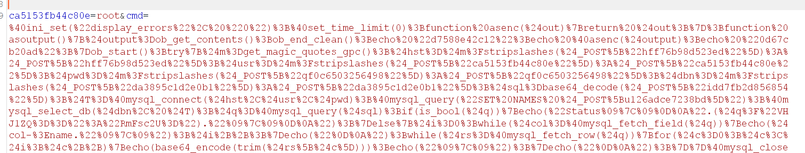 

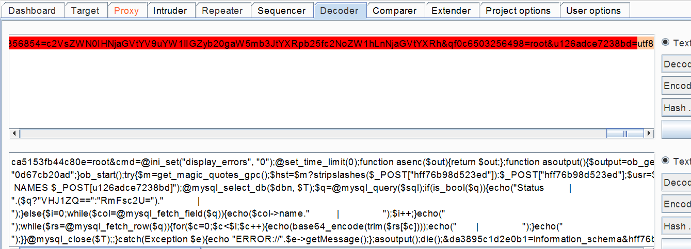 

调试代码并分析

服务器接收蚁剑客户端发送的连接数据库的必要信息和执行的sql语句

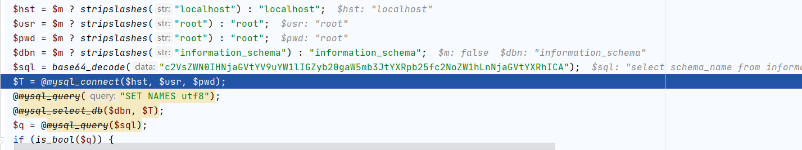 

进行数据库连接并执行sql语句

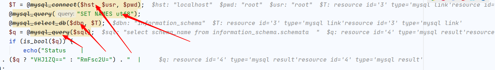 

将获取的结果集循环遍历并进行去除两边空格后base64编码输出到蚁剑客户端

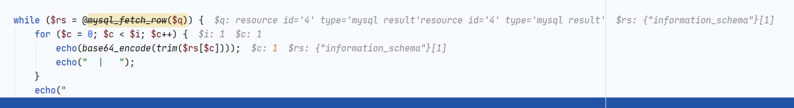 

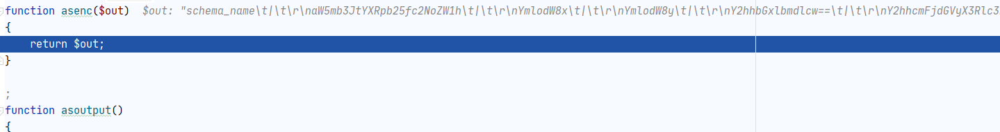 

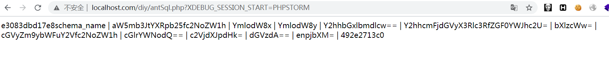 

 