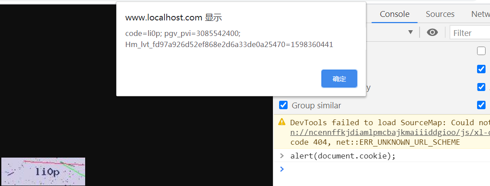
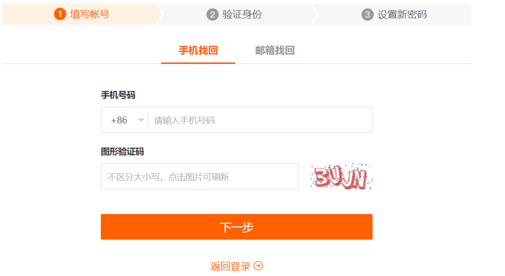

## 漏洞介绍

```
弱口令
	hydra、hashcat、jhon、PwDump7.exe 等
	phpmyadmin 批量爆破工具
	弱口令爆破工具
	
暴力破解
验证码安全问题
接收端前端可控
重置凭证未校验
任意用户密码修改
越权访问
数据遍历 航班平台漏洞
订单金额修改
```
#### 如何防止暴力破解?

```
1、使用验证码
2、对单个用户单位时间内限制登录次数
```

### 验证码安全问题

```
1、验证码前端验证 现在几乎没有使用了

2、验证码前端js可读
	(直接将生成的验证码存放到cookie中)
	正确的做法应该是将生成的验证码存放到服务器的session中

3、验证码可重复使用
	在没有再次点击提交按钮之前，验证码不会失效
	正确的做法:
		在第一次判断的时候校验验证码和session中的验证码是否相同并且session中的验证码必须不为空，进行校验之后再次将session中的验证码置为空

5、验证码可爆破
	a、验证码为:四位数的整形(一共1万位)
	b、验证码不能失效
    	次数失效 多次输入错误，验证码失效|多次输入错误需要进行拖动
    	时间失效（60s） 还有希望
验证码OCR识别

验证码验证类型
	字符验证
	滑动验证
	图形识别验证
使用验证识别平台
```

### 重置密码漏洞问题

```
1、构造回显包绕过
2、手机号+验证码+用户id未统一验证问题
    手机号+验证码没有进行绑定（三佳购物超市）
    手机号+验证码强制绑定验证
    手机号+验证码+用户名统一验证
```

##### 1、验证码前端js验证 

```
现在几乎没有使用了
```

##### 2、验证码在前端回显(可读)

```
直接带到cookie中，或者直接返回

一般后端生成验证码的代码的代码中有如下信息
setcookie('code',$string,time()+3600);  $string表示生成的验证码  (直接将生成的验证码存放到cookie中)

响应页面直接把验证码存储到浏览器的cookie中，这样无需验证，只要获取cookie中的code字段值，即可获取验证码内容(虽然这种方式很蠢，但是很多开发在使用)

这样可以使用python或者php写一个脚本获取每次cookie中的的验证码，进行批量爆破
php脚本的思路如下:
通过采用别的函数获取前端的验证码，使用fsockopen()/curl/file_get_contents()函数构造暴力破解的请求包，进行爆破即可
```



##### 3、验证码重复使用

​		**登录之后如果没有再次点击更换验证码，验证码依然可以使用**

```
后端生成验证码的页面
session_start();
$_SESSION['code'] = $string;  //$string表示生成的验证码
也就是登录之后如果没有再次点击更换验证码，验证码依然可以使用
	这样可以抓一次包进行爆破，重用验证码(这里没有点击操作，可以重用验证码)
如何解决?
	在第一次判断的时候校验验证码和session中的验证码是否相同并且session中的验证码必须不为空，进行校验之后再次将session中的验证码置为空
	核心代码
		if (isset($_GET['code']) && $_SESSION['code'] != '' && $_GET['code'] == $_SESSION['code']) {
            echo "code ok";
            $_SESSION['code'] = '';
```


​	**现在即使将code改为空也不能绕过**


##### 4、验证码可爆破

​	**密码找回页面**

```
条件:
    1、验证码位数较低 4位(纯数字) 10*10*10*10
    2、验证码不能失效
    	次数失效 多次输入错误，验证码失效|多次输入错误需要进行拖动
    	时间失效（60s） 还有希望
    3、是否进行错误次数验证
```

​	**一般页面**



##### 5、验证码OCR识别(接码平台)

```
使用接码平台
需用使用python脚本(将验证码的图片提交到该平台进行爆破)
 
使用机器学习(识别验证码)

```

### 重置密码漏洞挖掘

##### 1、构造回显包绕过

```
构造回显包绕过
```

##### 2、手机号、验证码、用户名未统一验证问题

```
手机号+验证码没有进行绑定
手机号+验证码强制绑定验证
手机号+验证码+用户名统一验证

可能出现的情况
	(三佳购物)1、找回密码的时候修改密码数据包(手机号、密码)，将手机号改为另一个不可控用户的手机号，这样就达到了修改别人用户密码的功能
	2、手机号+验证码强制绑定验证
        可能存在的问题
        $res = query("select * from xx where code = $_POST['code']");
        if($res){
            query("update xx set password = xx where phoneNumber = 1862425253");
        }
        如何更改:
            $res = query("select * from xx where code = $_POST['code'] and phoneNumber = 1862425253");
        在修改密码提交验证之后，不仅要对应用户提交的验证码进行校验，还用验证该验证码是不是之前的手机发出的
	3、手机号+验证码+用户名统一验证
		场景:cookie中有用户的加密信息，虽然有手机号+验证码一一对应验证，但是没有对用户(这里可能是一个加密的信息)进行验证
		可能存在的场景:	
		如果知道了其他用户的用户名称，再需要一个手机可以收到验证码就能够修改任意用户的密码
```

**手机号、验证码、用户未统一验证漏洞的特征:**

```
在重置密码的时候，抓包可以看到会对用户的手机号、验证码进行回显，如果是cookie或者session那就不行
```

##### 3、短信批量发送(不断发短信)

```
场景:在注册账户、忘记密码、手机验证码登录的时候
可以批量发送验证码，大量消耗网站的短信费用(1小时随便10几万的短信费用)
```

##### 4、任意用户密码修改

```
通过抓取修改用户信息的数据包，修改用户名称为其他用户的名称/修改用户id为其他用户的id
```
##### 5、构造回显包绕过

```
拦截请求响应包,获取成功时页面返回的响应包，用成功时的相应包替换失败时的响应包即可绕过
三佳购物存在更改密码时构造回显包绕过漏洞
```

##### 6、越权漏洞

```
水平越权(类似当前普通用户获取到其他普通用户的信息)
	id改变，权限类型不变
	没有严格验证权限、可以访问到该用户不该访问到的信息
	通过orderid查看其他用户的机票信息
	select. *· from order table where· orderid=xxxx·
    select· *·from ·xXX·where · uid = xxx
    通过更改orderid即可获取其他订单的信息获取用户信息
    修复
    select. *· from order table where· orderid=xxxx· and  username · =$SESSION [ 'name ' ]
    select· *·from ·xXX·where · uid =·$_COOKIE[ 'uid ']
垂直越权
	id不变，权限类型改变
	类似与普通用户权限提升为管理员权限 
交叉越权
	id改变，权限类型改变
```

##### 7、订单金额修改

**方式:**

```
直接修改商品价格
相同价格增加订单数量
相同订单数量减少产品价格
订单价格设置为负数(通过余额价格)
	update balanc set b_balanc = b_balanc -$_GET['price'] where id = xx
```

**防御方式:**

```
1、在发送支付请求之前根据具用户的用户id、商品名称、价格等信息生成对应的hash值，在用户发送支付请求时再次生成对应的hash值和之前的hash值进行比对，如果两次的hash值不一致就不处理该请求
2、根据商品id从后端获取商品的价格，然后根据发送的订单数量计算价格
3、商品的价格不能为负数、商品价格只能为正整数
4、大订单用户严格审核、查看流水账
```

##### 8、api鉴权漏洞

```
可以直接根据前端的js的信息直接访问对应的内容，完全不需要登录账户
```

##### 9、获取到后台账号密码,但是限制登录ip绕过

```
可能会存在
限制ip登录 (添加x-forward-for、client-ip等信息，ip为限制的ip)

例如:
    X-Forwarded-For:
    X-Forwarded-Host:
    X-Client-IP:
    X-remote-IP:
    X-remote-addr:
    True-Client-IP:
    X-Client-IP:
    Client-IP:
    X-Real-IP:
```


